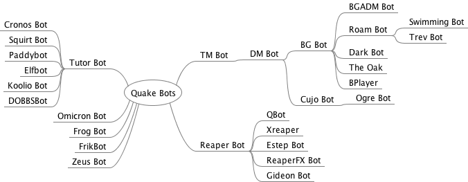

# Quake Bot Archive

The goal of this project is to archive **all versions** of **all Quake bots** (QuakeC modifications).

## Quake Bot Genealogy

Estimated Quake bot genealogy.

## Quake Bot Chronology

Estimated Quake bot public release history circa Aug 1996.

Date | Release | Comment
--- | --- | ---
Jul 25 1996 | qcc.tar.gz | QCC (compiler) source and QuakeC (.qc) source.
Aug 10 1996 | holo1.zip | HoloSelf v1.0 (pre-cursor to tmbot).
Aug 14 1996 | holo2.zip | HoloSelf  v2.0 (pre-cursor to tmbot).
Aug 21 1996 | **tmbot1.zip** | TMBot v1.0 (**first cooperative bot).**
Aug 23 1996 | **dmbot1.zip** | DMBot v1.0 (**first deathmatch bot).**
Aug 24 1996* | mybot.zip | MyBot v1.0 (* estimated).
Aug 25 1996* | mybot11.zip | MyBot v1.1 (* estimated).
Aug 26 1996 | tmbot11.zip | TMBot v1.1.
Aug 26 1996 | bgbot1.zip | BGBot v1.0.
Aug 27 1996 | tlgbot.zip | TLGBot v1.2a.
Aug 28 1996* | bgadmbot.zip | BGADM Bot v1.00 (*estimated).
Aug 28 1996* | mybot12.zip | MyBot v1.2 (* estimated).
Aug 28 1996* | mybot13a.zip | MyBot v1.3a (* estimated).
Aug 31 1996 | bgadm101.zip | BGADM Bot v1.01.
Aug 31 1996 | bgbot11.zip | BGBot v1.1.
Aug 31 1996* | wisp.zip | Wisp v1.0 (* estimated).

For a more complete bot chronology see:

* [Quake Bot Chronology](research/chronology.md)

## Quake Bot List

Alphabetical list of Quake bot names, authors, and local download links for all bots in the [bin/](bin/) directory.

Bot Name | Bot Author(s) | File
--- | --- | ---
Accuracy FMOD | Algirdas Kepezinskas aka "ZeCybEr" | accuracy.zip
Ache | Athos Konkoran Kryn | [ache.zip](bin/ache.zip)
Asdf's FMOD | Matt McChesney aka "asdf" | [asdfmod100.zip](bin/asdfmod100.zip)
Attacker | Jonathan Geary | [attacker.zip](bin/attacker.zip)
BGADM Bot | "Detour" | [bgadm101.zip](bin/bgadm101.zip) ([txt](bin/bgadm101.txt)) bgadmbot.zip
BGBot | Robert DeFilippo III aka "Punisher" | [bgbot20a.zip](bin/bgbot20a.zip) ([txt](bin/bgbot20a.txt)) [bgbot16.zip](bin/bgbot16.zip) ([txt](bin/bgbot16.txt)) [bgbot16_src.zip](bin/bgbot16_src.zip) [bgbot15.zip](bin/bgbot15.zip) ([txt](bin/bgbot15.txt)) [bgbot13.zip](bin/bgbot13.zip) ([txt](bin/bgbot13.txt)) [bgbot125.zip](bin/bgbot125.zip) ([txt](bin/bgbot125.txt)) [bgbot12.zip](bin/bgbot12.zip) ([txt](bin/bgbot12.txt)) [bgbot11.zip](bin/bgbot11.zip) ([txt](bin/bgbot11.txt)) [bgbot1.zip](bin/bgbot1.zip) ([txt](bin/bgbot1.txt))
Borg Bot | Calvin Rien | [borg12.zip](bin/borg12.zip)
Bot Hunt | Douglas H. King aka "Sea4" | [bthnt10.zip](bin/bthnt10.zip) ([txt](bin/bthnt10.txt))
Bot Player (BPlayer) | Wolfgang Lehrach aka "Wolf" | [bplayer2.zip](bin/bplayer2.zip) bplayer1.zip ([txt](bin/bplayer1.txt))
BotArena | Fabiano D. Amorim aka "Vegetous" | [botarena.zip](bin/botarena.zip) [bt_scr.zip](bin/bt_scr.zip)
BotSkin | "WACko" | [btskn22.zip](bin/btskn22.zip) [botskn20.zip](bin/botskn20.zip) ([txt](bin/botskn20.txt)) [botskn18.zip](bin/botskn18.zip) ([txt](bin/botskn18.txt)) botskn14.zip [botskn10.zip](bin/botskn10.zip)
BrBot | "DRaKuLL" | [brbot.7z](bin/brbot.7z)  [brbotqc.zip](bin/brbotqc.zip) brbot.exe
BuddyBot | "Parsec" | [bbot_b1.zip](bin/bbot_b1.zip)  [bbot_b11.zip](bin/bbot_b11.zip)
ClanBots | "slug" | clanv0.7hman.zip clanv0.6auto.zip clanv0.5auto.zip
Cronos Bot | "Cronos" | [hd_cbots_hd.zip](bin/hd_cbots_hd.zip) [hd_cbots.zip](bin/hd_cbots.zip) [hd_pak0.zip](bin/hd_pak0.zip) [hd_progs.zip](bin/hd_progs.zip) [cronobot107a.zip](bin/cronobot107a.zip) [cbotpak106.zip](bin/cbotpak106.zip) [cronobot101.zip](bin/cronobot101.zip)
CTF Bot | Drew Davidson aka "BZ" | [ctfbot13b1.zip](bin/ctfbot13b1.zip) ctfbot13.zip [newctf12.zip](bin/newctf12.zip) [ctfbot12.zip](bin/ctfbot12.zip) [ctfbot11.zip](bin/ctfbot11.zip)
CTFBot+ | Anthony Distler aka "*this" | [ctfbotp032399.zip](bin/ctfbotp032399.zip)  [ctfbotmw21.zip](bin/ctfbotmw21.zip) [ctfbotp071498-upgrade.zip](bin/ctfbotp071498-upgrade.zip) [ctfbotp071498u.zip](bin/ctfbotp071498u.zip) [ctfbotp070498.zip](bin/ctfbotp070498.zip) [ctfbot_060298.zip](bin/ctfbot_060298.zip)
Cujo | Jonathan E. Wright | [cujo14.zip](bin/cujo14.zip) [cujo13.zip](bin/cujo13.zip) cujo12c.zip cujo12b.zip cujo12a.zip ([txt](bin/cujo12a.txt)) cujo12.zip cujo11.zip [cujo10.zip](bin/cujo10.zip) ([txt](bin/cujo10.txt))
Dark Frogbot | "Pinsolle" | darkfrog.zip
Darkbot | Terry Hendrix aka "Dark_Skye" | [darkbot-fnl-q2.tar.gz](bin/darkbot-fnl-q2.tar.gz) [darkbot_0.13.9-pak.zip](bin/darkbot_0.13.9-pak.zip) [darkbot_0.13.9-src.zip](bin/darkbot_0.13.9-src.zip) drkbt013.zip [drkbt11b.zip](bin/drkbt11b.zip) darkbt10.zip darkbt09.zip [darkbt07.zip](bin/darkbt07.zip) drkbot04.zip [drkbot03.zip](bin/drkbot03.zip) [darkbt01.zip](bin/darkbt01.zip) [darkbotx.zip](bin/darkbotx.zip)
DarkCTF Bot | Terry Hendrix aka "Dark_Skye" | [darkctf13.zip](bin/darkctf13.zip)
DeathBot | James Boswell aka "FlashFire" | [death-64.zip](bin/death-64.zip) ([txt](bin/death-64.txt))
Demonshooter | "Shootermaster" | [shooter.zip](bin/shooter.zip)
DJBot | Dave James aka "DJ" | djbot1.zip
DM Bot | Nathaniel Gorham | [dmbot1.zip](bin/dmbot1.zip) ([txt](bin/dmbot1.txt))
DOBBSBot | Stephen Dobbs | [dobbsbot15bwp.zip](bin/dobbsbot15bwp.zip) dobbsbot15b.zip [dobbsbot15a.zip](bin/dobbsbot15a.zip)
Doombot | Roscoe A. Sincero aka "Legion" | [dmbt21b3.zip](bin/dmbt21b3.zip) dmbt21b1.zip dmbt20b2.zip doombot.zip
Drastic Reaper Bot | Mark Wheeler | [dreaper.zip](bin/dreaper.zip) [dreaper1e.zip](bin/dreaper1e.zip)
Drop Quad/Ring (FMOD) | Brian Mathiasen aka "EraZoR" | [quadring.zip](bin/quadring.zip)
EdBot | Edward Dawson aka "HotCakes" | [edbot0-04.zip](bin/edbot0-04.zip)  [edbotsrc0-04.zip](bin/edbotsrc0-04.zip)
ELFBOt | "SkinSki" aka "MauveBib" | [elfbot.zip](bin/elfbot.zip)
Eliminator Bot (CBot) | Cameron B. Newham | [elim14.zip](bin/elim14.zip) ([txt](bin/elim14.txt)) [elimsrc.zip](bin/elimsrc.zip) elim13.zip [elim12.zip](bin/elim12.zip) ([txt](bin/elim12.txt)) [elimtst1.zip](bin/elimtst1.zip)  [elim11.zip](bin/elim11.zip) ([txt](bin/elim11.txt)) elim10.zip ([txt](bin/elim10.txt))
Eliminator Bot v1 | Jonathan Down aka "Perged" | [elim141.zip](bin/elim141.zip)
Eliminator Bot v2 | Jonathan Down aka "Perged" and P. T. Craig aka "FuzzKatT" | [elim20b7.zip](bin/elim20b7.zip)
Estep Bot (EsTePBot) | Enrique Gonzalez Alonso aka "EsTePaRiO" | [estepbot2eng.zip](bin/estepbot2eng.zip) [estepbot2.zip](bin/estepbot2.zip)
Frag Bot | Richard Peacock aka "The Goat" | [fragbot.zip](bin/fragbot.zip)
Frik-TF | Raymond Martineau | [friktf-092800.zip](bin/friktf-092800.zip) [friktf-092800-src.zip](bin/friktf-092800-src.zip) friktf-092800-qw.zip friktf-092800.tar.gz friktf-051901.zip [friktf-051800.zip](bin/friktf-051800.zip) [friktf-051800-qw.zip](bin/friktf-051800-qw.zip) [friktf-051800-src.zip](bin/friktf-051800-src.zip) frik-tf.zip [friktfqw.zip](bin/friktfqw.zip)
FrikBot + Artifact Quake (Runebot) | Chuck Parsons | [rnbt9.zip](bin/rnbt9.zip) [rnbt4.2.zip](bin/rnbt4.2.zip)  rnbt3.6.zip rnbt3.4.zip
Frikbot + CTF | Benjamin Darling aka "Electro" | [frikbotctf_01.zip](bin/frikbotctf_01.zip)
FrikBot + Deathmatch Essentials | Ryan Smith aka "Frika C" | [frikdme.zip](bin/frikdme.zip)
FrikBot + Dissolution of Eternity | Ryan Smith aka "Frika C" | [frikmp02.zip](bin/frikmp02.zip)
FrikBot + Final Arena | Ryan Smith aka "Frika C" | [frikfa.zip](bin/frikfa.zip)
FrikBot + Head Hunters | Chuck Parsons | hhbot.zip
FrikBot + Holy Wars | Ryan Smith aka "Frika C" | [frikholy.zip](bin/frikholy.zip)
FrikBot + Last Man Standing | Raymond Martineau | [frik-lms.zip](bin/frik-lms.zip)
FrikBot + MidAir + Kombat Teams | Alexey Pakhomov aka "ParboiL" | [fbma102.zip](bin/fbma102.zip) fbma102_src.zip
FrikBot + PainKeep | Ryan Smith aka "Frika C" | fbxpk.zip [frikpk.zip](bin/frikpk.zip)
FrikBot + PerQuake | Ryan Smith aka "Frika C" | [frikper.zip](bin/frikper.zip)
FrikBot + QuakeWorld | Ryan Smith aka "Frika C" | [frkqw01.zip](bin/frkqw01.zip)
FrikBot + QW Vwep | Ryan Smith aka "Frika C" | [frikvwep.zip](bin/frikvwep.zip)  [frikqw03.zip](bin/frikqw03.zip)
FrikBot + Rhino's Ultimate Quake | Ryan Smith aka "Frika C" | [frikruq.zip](bin/frikruq.zip)
FrikBot + Rocket Arena | Raymond Martineau | [frikra.zip](bin/frikra.zip)
FrikBot + Scourge of Armagon | Ryan Smith aka "Frika C" | [frikmp01.zip](bin/frikmp01.zip)
FrikBot + Zerstorer | Ryan Smith aka "Frika C" | [frikzer.zip](bin/frikzer.zip)
FrikBot X (FBX) | Ryan Smith aka "Frika C" | [fbxc.zip](bin/fbxc.zip) [fbxb.zip](bin/fbxb.zip) [fbxa.zip](bin/fbxa.zip)
FrikBot X DreamCast (FBXDC) | Ryan Smith aka "Frika C" | [fbxdc.zip](bin/fbxdc.zip)
FrikBot X+ (FBX+) | Igor9 | [fbx+.zip](bin/fbx+.zip)
FrikBot X++ (FBX++) | Joel Baxter aka "Johnny Law" | [fbx++.zip](bin/fbx++.zip)
FrikBot | Ryan Smith aka "Frika C" | [frkbt09b.zip](bin/frkbt09b.zip) [frikbt09.zip](bin/frikbt09.zip) [frik9tst.zip](bin/frik9tst.zip) [frikbt08.zip](bin/frikbt08.zip) [frikbt07.zip](bin/frikbt07.zip) [frikbt06.zip](bin/frikbt06.zip) [frikbt05.zip](bin/frikbt05.zip) [frikbt04.zip](bin/frikbt04.zip) 
Frogbot + Clan Arena (FBCA) | "Baker" | [frogbots-099.zip](bin/frogbots-099.zip)
Frogbot + Clan Arena (FBCA) | Alexey Pakhomov aka "ParboiL" | fbca096b.zip fbca089se.zip [fbca088se3.zip](bin/fbca088se3.zip) fbca088se.zip [fbca088.zip](bin/fbca088.zip) fbca86se.zip fbca086.zip
Frogbot + Clan Arena (FBCA) | Matt McChesney aka "Asdf" | fbca085.zip fbcasounds.zip fbca084.zip
Frogbot + Clan Arena (FBCA) | Rui Neto aka "Trinca" | [qwprogs379.rar](bin/qwprogs379.rar) [trinca-fbca-qwprogs.zip](bin/trinca-fbca-qwprogs.zip) [src379.rar](bin/src379.rar) [fbca_progs.zip](bin/fbca_progs.zip) [fbca375ways.zip](bin/fbca375ways.zip)
Frogbot + Clan Arena + Kombat Teams | Alexey Pakhomov aka "ParboiL" | [fbca102kt.zip](bin/fbca102kt.zip)  fbca102kt-rc1.zip [fbca101final.zip](bin/fbca101final.zip) [fbca101kt.zip](bin/fbca101kt.zip) [fbca101alt.zip](bin/fbca101alt.zip) fbca095kt.zip [fbca092kt.zip](bin/fbca092kt.zip) fbca091kt.zip fbca090kt.zip fbca089kt.zip 
Frogbot + CTF (FBCTF) | Gerard Ryan aka "numb" | [fbctf0532.zip](bin/fbctf0532.zip) fbctf053.zip fbctf052.zip fbctf041.zip [fbctf035.zip](bin/fbctf035.zip) fbctf034.zip fbctf033.zip fbctf032.zip fbctf030.zip [fbctf027.zip](bin/fbctf027.zip) fbctf026.zip fbctf024.zip fbctf023.zip fbctf021.zip fbctf019.zip fbctf015.zip fbctf014.zip fbctf013.zip fbctf011.zip fbctf010.zip fbctf006.zip fbctf004.zip
Frogbot + Holy Wars | Gerard Ryan aka "numb and Paolo Perrotta aka "Nusco" | hw_frogbotf.zip hw_frogbot14h.zip hw_frogbot14f.zip hw_frogbot14.zip [hw_frogbot13.zip](bin/hw_frogbot13.zip)
Frogbot + QuakeWorld | Rich Whitehouse aka "thefatal" | [qwsvfrog.zip](bin/qwsvfrog.zip)
Frogbot + Rocket Arena | Alexey Pakhomov aka "ParboiL" | [fbra.zip](bin/fbra.zip)
Frogbot + Rocket Arena | Brian Mathiasen aka "Erazor" | fbarena013.zip
Frogbot 2000 | Dennis de Boer aka "Justice" | [f2k006d.zip](bin/f2k006d.zip) [versie.zip](bin/versie.zip) [f2k003c.zip](bin/f2k003c.zip) f2k001a.zip 2000.zip
Frogbot BotMatch Arena | Alex aka "DmSouL" | [botmatch.zip](bin/botmatch.zip)  [source_of_bm.zip](bin/source_of_bm.zip) bm119gl.zip bm116se.zip
Frogbot Deathmatch | Alexey Pakhomov aka "ParboiL" | [fbdm012.zip](bin/fbdm012.zip) [fbdm07.zip](bin/fbdm07.zip)
Frogbot Special Edition | Brian Mathiasen aka "Erazor" | fb013se.zip
Frogbot | Robert Field aka "Frog" | [frogbot013.zip](bin/frogbot013.zip) [frogfix1.zip](bin/frogfix1.zip) fixedsrc.zip frog_src.zip fbph.zip [frogbot012c.zip](bin/frogbot012c.zip) frogbot012b.zip frogbot012a.zip frogbot012.zip frogbot011b.zip frogbot011.zip frogbot009.zip frogbot007.zip frogbot005.zip frogbot000.zip 
Gideon Bot | Matthew Turvey | [gidbot.zip](bin/gidbot.zip)
GlacierBot | Rainier Rapera aka "IceDagger" | [gb027b.zip](bin/gb027b.zip)
GuardBot | Peter van Wingerden | [grdbot23.zip](bin/grdbot23.zip) grdbot13.zip guardbot.zip
GYPObot | Stephen Dobbs | [gypobot.zip](bin/gypobot.zip)
Hellsmash | Khin Mannering aka "Dr. Shadowborg" | [qsr04apatch1.7z](bin/qsr04apatch1.7z) [qsr04a.7z](bin/qsr04a.7z) [qsrbeta3a.zip](bin/qsrbeta3a.zip) [qsrbeta3a_src.zip](bin/qsrbeta3a_src.zip) [qsrbeta3x.zip](bin/qsrbeta3x.zip) [qsrbeta3.zip](bin/qsrbeta3.zip) qsrbeta1b.zip qsrbeta1.zip
Holo Soldier FMOD | Algirdas Kepezinskas aka "ZeCybEr" | holomod.zip
Human Bot (Hbot) | Jeffrey Lee | [hbot.zip](bin/hbot.zip)
Indecisive Bot (Gyrobot) | Aaron Logue aka "Gyro Gearloose" | [gyrobot.zip](bin/gyrobot.zip) [gbotsrc.zip](bin/gbotsrc.zip)
IronWulvt's Deathmatch Bot | Ben Garrod aka "IronWulvt" | [iwbot21.zip](bin/iwbot21.zip) ([txt](bin/iwbot21.txt)) iwbot20.zip [iwbot16.zip](bin/iwbot16.zip) iwbot15.zip [iwbot1.zip](bin/iwbot1.zip) ([txt](bin/iwbot1.txt))
JBot | Jeffrey Lee | [jbot.zip](bin/jbot.zip)
KarNag Bot | Ken Madlener | [knbot45.zip](bin/knbot45.zip) [knbot03.zip](bin/knbot03.zip)
Khol's FMODS | "Khol" | kfmod.zip
Killer Qcbot | William  Ravaine aka "Killer-Sub" | [kqcbots095b.zip](bin/kqcbots095b.zip) kqcbotsource.zip
Kooliobot | Robert de Heus aka "Koolio" | [kooliobot.zip](bin/kooliobot.zip) koolio.zip
Lightning Gun Competition (LGC) | Phil Romov aka "peheyele" | [lgc3.zip](bin/lgc3.zip) [lgc2c.zip](bin/lgc2c.zip) [lgc2.zip](bin/lgc2.zip) lgc.zip
Lithium CTF Bot | Juan Ignacio Rava aka "Johnny" | [lith091c.zip](bin/lith091c.zip)
LoydBot | Loyd aka "Juninho" | [lbotv10.zip](bin/lbotv10.zip)
MaNiAc's FrogBot MOD (lag simulation) | Michael Turitzin aka "MaNiAc" | [lagmod.zip](bin/lagmod.zip)
MaNiAcBot | Michael Turitzin aka "MaNiAc" | [maniacbt.zip](bin/maniacbt.zip) maniacbt12.zip fbmod.zip
Mathfrag | Khin Mannering aka "Dr. Shadowborg" | [mlx20b.zip](bin/mlx20.zip)
MegaBot | "Vic" | [megabot.zip](bin/megabot.zip)
Midair Bots | Benjamin Darling aka "Electro" and "Vomit" | [midair_qwbot.rar](bin/midair_qwbot.rar) [midairbots_all.zip](bin/midairbots_all.zip) [midairbots.zip](bin/midairbots.zip)
Mod Pak 1 FMOD | "Neophyte" | mpak1v12.zip
Motd FMOD | Algirdas Kepezinskas aka "ZeCybEr" | motd.zip
MyBot | Stephen Vanterpool | [mybot16.zip](bin/mybot16.zip) ([txt](bin/mybot16.txt)) mybot14.zip [mybot13a.zip](bin/mybot13a.zip) ([txt](bin/mybot13a.txt)) [mybot12.zip](bin/mybot12.zip) ([txt](bin/mybot12.txt)) [mybot11.zip](bin/mybot11.zip) ([txt](bin/mybot11.txt)) [mybot.zip](bin/mybot.zip) ([txt](bin/mybot.txt))
Navy SEALs sQuad bots | William van der Sterren | [nseal201.zip](bin/nseal201.zip) sqdbt201.zip
Ogre Bot | "Lava Man" | [ogrebot.zip](bin/ogrebot.zip)
Omicron Bot | Jan Paul van Waveren aka "Mr. Elusive" and Miklos de Rijk aka "H2SO4" | [obots102.zip](bin/obots102.zip) [obots101.zip](bin/obots101.zip) obots100.zip
Omicron Fixes | Joel Baxter aka "Johnny Law" | [obots102-fixed.zip](bin/obots102-fixed.zip)
Optimized Frogbot qboost3 (Amiga) | Christian Michael aka "surgeon" | [frogbot.lha](bin/frogbot.lha)
OrionBots | "Orion" | [orionbots4rel.zip](bin/orionbots4rel.zip) [orionbots_v2.zip](bin/orionbots_v2.zip) [orionbots_qc_beta5.zip](bin/orionbots_qc_beta5.zip)
Paddybot | Patrick Stimson aka "sniper" | paddybot02.zip paddybot.zip
Paroxysm (POXbot) | Frank Condello aka "pOx" | [paroxysm.zip](bin/paroxysm.zip) [pox120b.zip](bin/pox120b.zip) [pxsrc120.zip](bin/pxsrc120.zip) [pox111b2.zip](bin/pox111b2.zip) [pox111b.zip](bin/pox111b.zip) [pox102b.zip](bin/pox102b.zip) [pxqc102b.zip](bin/pxqc102b.zip) [pox101bu.zip](bin/pox101bu.zip) [pox_100.zip](bin/pox_100.zip) [poxqc100.zip](bin/poxqc100.zip) [pox_04b2.zip](bin/pox_04b2.zip)
Quake Bot (QBot) | "Grinder" | [qbot11.zip](bin/qbot11.zip)
Quake Dodgeball | Brendan aka "Trickle" and "Orion" | [quake_dodgeball_v1.2.6.zip](bin/quake_dodgeball_v1.2.6.zip) [db_src_2016.zip](bin/db_src_2016.zip) [quake_dodgeball_1.1.zip](bin/quake_dodgeball_1.1.zip)
R Bot | Ross Johnson aka "ColdKill" | [rbot70.zip](bin/rbot70.zip) [rbot20.zip](bin/rbot20.zip) rbot.zip
RABot | Rodrigo Marx aka "Shooter" | [mwrrabot222cl.zip](bin/mwrrabot222cl.zip) [rabot.zip](bin/rabot.zip)
Reaper + DM4 | Daniel Hein aka "Hades" | [dm4reaper.zip](bin/dm4reaper.zip)
Reaper + Painkeep | Bent Svendsen aka "Decker" | [pkbot.zip](bin/pkbot.zip)
Reaper + Scourge of Armagon | Bent Svendsen aka "Decker" | [hipreap3.zip](bin/hipreap3.zip)
Reaper Bot | Steven Polge | [reaprb81.zip](bin/reaprb81.zip) ([txt](bin/reaprb81.txt)) [rb81src_unoff.zip](bin/rb81src_unoff.zip) [reaprb80.zip](bin/reaprb80.zip) reaprb75.zip ([txt](bin/reaprb75.txt)) [reaprb07.zip](bin/reaprb07.zip) ([txt](bin/reaprb07.txt)) [reaprb06.zip](bin/reaprb06.zip) reaprb05.zip
ReaperFX Bot | Paul Johnstone aka "Pob the Impaler" | [reaperfx.zip](bin/reaperfx.zip)
Reformed Reaper Bot | "win32ch" | [rrbotprogs.zip](bin/rrbotprogs.zip)  [rrbotsrc.zip](bin/rrbotsrc.zip)
Ric's Reaper Bots | "Ric" | [reap081h.zip](bin/reap081h.zip)
Roam Bot | Carson Sutton aka "Crimson" | [roambot1.zip](bin/roambot1.zip) ([txt](bin/roambot1.txt))
Rogue Bot | Benjamin Darling aka "Electro" | [rbot.zip](bin/rbot.zip)
SamBot | Sam Stephens aka "Spam-man" | [sambot.zip](bin/sambot.zip) ([txt](bin/sambot.txt))
Sigmund Bot | Rich Whitehouse aka "thefatal" | [sigbot2.zip](bin/sigbot2.zip) [sigbtsrc.zip](bin/sigbtsrc.zip) [sigbot1.zip](bin/sigbot1.zip)
Square Bot | Ashley Reynolds aka "Ze0" | [square01a.zip](bin/square01a.zip) squaretst.zip
Squirt Bot | Michael Buettner aka "Squirt" | [squirt13.zip](bin/squirt13.zip) sq12to13.zip squirt12b.zip [squirt12.zip](bin/squirt12.zip) [squirt11.zip](bin/squirt11.zip) squirt10.zip
SuPeRMan Bot | "(KSA)Tekken" | superman11.zip
Swimming Bot (Swimbot) | Greg Fukui aka "baloo the bear" | [swbot104.zip](bin/swbot104.zip) ([txt](bin/swbot104.txt)) [swbot103.zip](bin/swbot103.zip) swbot102.zip swbot101.zip swbot1.zip
Target Player Place (Place Bot) | "Vengence" | [place2.zip](bin/place2.zip)  [pbot_src.zip](bin/pbot_src.zip)
Tballman | "Mother" | [tballman.zip](bin/tballman.zip)
TD-BOT | ? | tdbot1_0.zip
TD2 Mech Bot | ? | [mech.zip](bin/mech.zip)
Team FMOD | "Shelob" | stfm10.zip
Team Fortress Bots | Darryl Atchison aka "coffee" | [tf_bots07.zip](bin/tf_bots07.zip)
TeamFortress Bot | Valery Schedrin aka "Forthpick" | [teamfbot.zip](bin/teamfbot.zip)
TeamTalk+ (FMOD) | Algirdas Kepezinskas aka "ZeCybEr" | [ttalk.zip](bin/ttalk.zip)
TFBots | Jeff aka "wattsup" | [tfbot077.zip](bin/tfbot077.zip) [tfbot076.zip](bin/tfbot076.zip)
TFBots | Joern Strombach aka "Nexus" | [tfbot080.zip](bin/tfbot080.zip)
TFBots | Wolfgang Lehrach aka "RainKing" | tfb-v07.zip
The Alf | Bjorn-Erik Solli aka "Jack O. Trade" | nnctf.zip nnsource.zip
The Lone Gunmen QuakeBOT (Larva) | James Cullen aka "Jaymz" and Chris Cullen aka "Incubus" | [tlgbot.zip](bin/tlgbot.zip) ([txt](bin/tlgbot.txt))
The Moron Bot | Rich Whitehouse aka "thefatal" | [mbr1.zip](bin/mbr1.zip) [mbr1_src.zip](bin/mbr1_src.zip)
The Oak | John Crickett and Neil Henderson | [oak0405_final.zip](bin/oak0405_final.zip) [oak0405_fixed.zip](bin/oak0405_fixed.zip) [oak0405.zip](bin/oak0405.zip) oak0855.zip [oak085.zip](bin/oak085.zip) oak084.zip [oak083.zip](bin/oak083.zip) [oak081.zip](bin/oak081.zip) [oak_old.zip](bin/oak_old.zip)
TM Bot | Micheal Polucha and Tim Polucha | [tmbot11.zip](bin/tmbot11.zip) ([txt](bin/tmbot11.txt)) [tmbot1.zip](bin/tmbot1.zip) ([txt](bin/tmbot1.txt))
Total Destruction Bot (TDBot) | Rodrigo Marx aka "Shooter" | [tdbot.zip](bin/tdbot.zip)
TrevBot | Kris O'Shea | [trevbot.zip](bin/trevbot.zip)
Tutor Bot + Holy Wars | Connor Caple aka "RiEvEr" | [holy_tb.zip](bin/holy_tb.zip)
Tutor Bot | Darryl Atchison aka "coffee" | [tutor.zip](bin/tutor.zip)
Ultimate Regular Quake Patch (URQP) | Matthias Buecher aka "Maddes" | [urqp106a.zip](bin/urqp106a.zip) [urqp106.zip](bin/urqp106.zip) [urqp105.zip](bin/urqp105.zip) [urqp104a.zip](bin/urqp104a.zip)
UnknownBot | Brian L. | [ubot14.zip](bin/ubot14.zip)
UrreBot | Marko Permanto aka "Urre" | [urrebot20050820.zip](bin/urrebot20050820.zip) [urrebot20050813.zip](bin/urrebot20050813.zip)
VeNgAb0T | "WuPP" | [venga.zip](bin/venga.zip)
Vicinity Bot | "Black" | vicinityqwprogs.zip vicinitymodels.zip vicinitysource.zip
Victim Bot | Tony Tang aka "The TangMaster" | [vbot11.zip](bin/vbot11.zip) ([txt](bin/vbot11.txt)) [vbot1.zip](bin/vbot1.zip)
WarBot | Muhammad Hidayat Bin Sman | warbt13a.zip
Wisp | Iikka Paavolainen | [wisp.zip](bin/wisp.zip) ([txt](bin/wisp.txt))
WLBot | Kualker Koisa aka "Matador" | [wlbot21.7z](bin/wlbot21.7z) wlbot1.9.zip
XKteams | Mark | xkteams2.zip xkteams1705.zip xkteams1705s.zip
Xreaper | Ruud Heemskerk aka "Mephisto" | [xreaperb130.zip](bin/xreaperb130.zip) [xreaperb130_unoff.zip](bin/xreaperb130_unoff.zip) setup.exe
Zeus Bot | Jonathan E. Wright aka "Nelno the Amoeba" | [zeus205s.zip](bin/zeus205s.zip) [zeus205.zip](bin/zeus205.zip) [zeus_src.zip](bin/zeus_src.zip) [zeus2042.zip](bin/zeus2042.zip) zeus2041.zip [zeus204.zip](bin/zeus204.zip) [zeus203b.zip](bin/zeus203b.zip) zeus202b.zip zeus201.zip zeus20.zip [zeus10.zip](bin/zeus10.zip) ([txt](bin/zeus10.txt))

File Column:
- **no link** Indicates I discovered the filename but could not find a copy of the file to archive.
- Separate text files are included when available as some differ from the contents of the .zip files.

## Quake Bot Extra Files

Many bots have extra files that are not part of the main bot release.

This may include sample code or code skeletons, waypoint or route files for supported maps (required for bot navigation), additional bot configurations or configuration tools, and replacement bot models or skins.

These extra files are stored in the bot archive under the [bin/](bin/) directory organized by a subdirectory named for the bot.

The list below summarizes the subdirectories of extra bot files in the archive.

Bot Name | Description | Subdirectory
--- | --- | ---
Eliminator Bots | Map support for eliminator bots. | [eliminator/](bin/eliminator/)
FrikBots | Map support and tools for frikbots. | [frikbot/](bin/frikbot/)
FrogBots | Map support and sample code for frogbots. | [frogbot/](bin/frogbot/)
Omicron Bots | Map support for omicron bots. | [omicron/](bin/omicron/)
Reaper Bots | Additional skins for reaper bots. | [reaper/](bin/reaper/)
Other | Sample code and skeleton code for bots. | [other/](bin/other/)

## About This Project

Quake is a computer game released by id Software in 1996. The source code (QuakeC) that controls the game was released at around the same time.

A bot mod is a modification to the Quake game code to introduce "intelligent" opponents, typically for deathmatch play. Before the introduction of bots, deathmatch game play required access to a fast network or internet connection and other human players.

Quake bots represent a breakthrough in computer game artificial intelligence at the time (e.g. opponents that acted like humans), and are also a lot of fun to play (e.g. a multiplayer game can be enjoyed as a singleplayer game).

Quake bot mods were mostly developed between 1996 and 1998, were distributed as binary or source files, and were hosted on third-party websites.

There is no definitive list of Quake bots nor single location from which they can be downloaded.

This project seeks to archive and make available all Quake bot modifications in their original distributed form, mostly .zip files that may contain binary files and/or source code.

In addition, the project also seeks to locate and make available all versions of modifications (e.g. older versions) as well as binaries and source code for mods that may not have been made public (e.g. contributed by bot authors directly).

## How You Can Help

Perhaps you can help to make this bot archive more complete.

* Do you know of a missing Quake bot?
* Do you have a copy of a missing file from the above list?
* Do you know a bot author's real name?
* Do you have have an older or newer version of a listed bot mod?
* Do you have access to the source code for an old bot?
* Do you know how to contact a bot mod author?
* Do you have access to an archive of a Quake website from back in the day?

If you can help, please email Jason at jason.brownlee05@gmail.com

### Wishlist

We also have a wishlist of known bot filenames and broken download URLs.

Perhaps you have one of the files listed?

* Quake bot Filename wishlist: [wishlist.txt](research/wishlist.txt)
* Quake bot URL wishlist: [wishlist_urls.txt](research/wishlist_urls.txt)

## Acknowledgements

This quake bot archive would not be as complete as it is without the generousness help from the Quake community.

Special thank you to: John Crickett, Joel Baxter aka "Johnny Law", Hannes aka "Spirit" (from quaddicted), Fabiano D. Amorim aka "vegetous", Benjamin Darling aka "Electro", Rui Neto aka "Trinca", Rich Whitehouse aka "thefatal", Marko Permanto aka "Urre", and Mark Wheeler.
