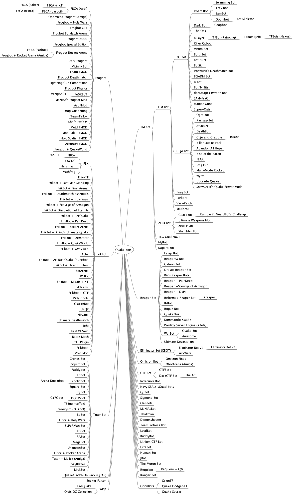

# Quake Bot Archive

The goal of this project is to archive **all versions** of **all Quake bots**.

## About

Quake is a computer game released by id Software in mid 1996. The source code (QuakeC) that controls the game was released shortly after.

A [Quake bot modification](#quake-bot-list) (mod) is a third-party server-side modification to the Quake game code (QuakeC) to introduce intelligent non-playable characters, typically opponents for deathmatch play. A [client-side Quake bot](#client-side-quake-bot-list) is a third-party program that communicates with the game via the network protocol and adds intelligent non-playable characters to the game.

Quake bots represent a historical breakthrough in computer game artificial intelligence (e.g. opponents that act like human players) and are also a lot of fun to play (e.g. a multiplayer game that can be enjoyed as a single player game).

Quake bots were mostly developed between 1996 and 2000 and were hosted on a tangle of third-party websites. Most of these websites have disappeared over the last 25 years, along with many bots themselves. **This is a terrible loss**!

This project seeks to (1) **locate**, (2) **archive**, and (3) **host** all versions of all Quake bots in their original distributed form.

If you have backups of old Quake bots, [you can help](#Help).

If you need help running bots in quake, [see this excellent guide](https://steamcommunity.com/sharedfiles/filedetails/?id=123626484) by Joel Baxter.

## Quake Bot Chronology and Genealogy

Here are some fun meta projects using the quake bot archive:

* [Quake Bot Chronology](research/chronology.md)
* [Quake Bot Essays](research/essays/README.md)

Quake Bot Genealogy:

## Quake Bot List

Alphabetical list of Quake bot names, authors, and local download links for all QuakeC bots (server-side) in the [bin/](bin/) directory.

Bot Name | Bot Author(s) | File
--- | --- | ---
Abandon All Hope (Cujo) | John McClure | [abnd2a.zip](bin/abnd2a.zip) ([txt](bin/abnd2a.txt)) [abandon2.zip](bin/abandon2.zip) ([txt](bin/abandon2.txt)) abandon1.zip
Accuracy FMOD (Frogbot) | Algirdas Kepezinskas aka "ZeCybEr" | accuracy.zip
Ache (Frikbot) | Athos Konkoran Kryn | [ache.zip](bin/ache.zip)
Arena Kooliobot | Robert de Heus aka "Koolio" | rakoolio.zip
Asdf's FMOD (Frogbot) | Matt McChesney aka "asdf" | [asdfmod100.zip](bin/asdfmod100.zip)
Attacker | Jonathan Geary | [attacker.zip](bin/attacker.zip) ([txt](bin/attacker.txt))
Awesome (Warbot) | Brett King aka "BulkA" | [awesome.7z](bin/awesome.7z)
AxxWars (Cujo, Eliminator) | Akke Monasso | [axxwars10.zip](bin/axxwars10.zip) ([txt](bin/axxwars10.txt))
Battle Mech (Frikbots) | Dan Hale aka "Wazat" | [battlemech1_1.zip](bin/battlemech1_1.zip) [bmech_src.zip](bin/bmech_src.zip) [battlemech-1.1.tar.gz](bin/battlemech-1.1.tar.gz.zip) ([txt](bin/battlemech-linux-1.1.txt)) [bmech.zip](bin/bmech.zip)
Best Of Void (Frikbot) | Dan Hale aka "Wazat" | [bestvoid.zip](bin/bestvoid.zip)
BGADM Bot | George Leithner aka "Detour" | [bgadm101.zip](bin/bgadm101.zip) ([txt](bin/bgadm101.txt)) bgadmbot.zip
BGBot | Robert DeFilippo III aka "Punisher" | [bgbot20a.zip](bin/bgbot20a.zip) ([txt](bin/bgbot20a.txt)) [bgbot16.zip](bin/bgbot16.zip) ([txt](bin/bgbot16.txt)) [bgbot15.zip](bin/bgbot15.zip) ([txt](bin/bgbot15.txt)) [bgbot13.zip](bin/bgbot13.zip) ([txt](bin/bgbot13.txt)) [bgbot125.zip](bin/bgbot125.zip) ([txt](bin/bgbot125.txt)) [bgbot12.zip](bin/bgbot12.zip) ([txt](bin/bgbot12.txt)) [bgbot11.zip](bin/bgbot11.zip) ([txt](bin/bgbot11.txt)) [bgbot1.zip](bin/bgbot1.zip) ([txt](bin/bgbot1.txt))
Borg Bot | Calvin Rien | [borg12.zip](bin/borg12.zip) ([txt](bin/borg12.txt))
Bot 'N Bits (BGBot) | Sam Marshallsay aka "Flux" | [botnbits.zip](bin/botnbits.zip) ([txt](bin/botnbits.txt))
Bot Hunt | Douglas H. King aka "Sea4" | [bthnt10.zip](bin/bthnt10.zip) ([txt](bin/bthnt10.txt))
Bot Player (BPlayer) | Wolfgang Lehrach aka "Wolf" | [bplayer2.zip](bin/bplayer2.zip) bplayer1.zip ([txt](bin/bplayer1.txt))
BotArena (FrikBot) | Fabiano D. Amorim aka "Vegetous" | [botarena.zip](bin/botarena.zip) [bt_scr.zip](bin/bt_scr.zip)
BotSkin | Warren Cheung aka "WACko" | [btskn22.zip](bin/btskn22.zip) ([txt](bin/btskn22.txt)) botskn21.zip [botskn20.zip](bin/botskn20.zip) ([txt](bin/botskn20.txt)) botskn19.zip [botskn18.zip](bin/botskn18.zip) ([txt](bin/botskn18.txt)) botskn17.zip botskn16.zip botskn15.zip botskn14.zip botskn13.zip botskn12.zip botskn11.zip [botskn10.zip](bin/botskn10.zip)
BrBot (Reaper) | "DRaKuLL" | [brbot.7z](bin/brbot.7z)  [brbotqc.zip](bin/brbotqc.zip) [brbot.exe](bin/brbot.exe)
BuddyBot | Chris Steegmans aka "Parsec" | [bbot_b1.zip](bin/bbot_b1.zip)  [bbot_b11.zip](bin/bbot_b11.zip)
Catch The Shrimp | "SkinSki" | [shrimp.zip](bin/shrimp.zip)
ClanBots | Brian McDonald aka "Slug" | [clanbotv0.9d.zip](bin/clanbotv0.9d.zip) clanbotv0.9b.zip clanv0.7eman.zip clanv0.7hman.zip clanv0.6auto.zip clanv0.5auto.zip clanv0.5man.zip
CoopBot | Michael Messina | coopbotx.zip [coopbot3.zip](bin/coopbot3.zip)
CronosBot | "Cronos" | [hd_cbots_hd.zip](bin/hd_cbots_hd.zip) [hd_cbots.zip](bin/hd_cbots.zip) [hd_pak0.zip](bin/hd_pak0.zip) [hd_progs.zip](bin/hd_progs.zip) [cronobot107a.zip](bin/cronobot107a.zip) cronobot107.zip cronobot106.zip [cbotpak106.zip](bin/cbotpak106.zip) cronobot105.zip cronobot104.zip cronobot103.zip cronobot102.zip [cronobot101.zip](bin/cronobot101.zip) ([txt](bin/cronobot101.txt)) cronobot100.zip
CTF Bot | Drew Davidson aka "BZ" | [ctfbot13b1.zip](bin/ctfbot13b1.zip) ([txt](bin/ctfbot13b1.txt)) [newctf12.zip](bin/newctf12.zip) ([txt](bin/newctf12.txt)) [ctfbot12.zip](bin/ctfbot12.zip) ([txt](bin/ctfbot12.txt)) [ctfbot11.zip](bin/ctfbot11.zip) ([txt](bin/ctfbot11.txt))
CTF Plugin (Frikbot) | Dan Hale aka "Wazat" | [ctfprogs.zip](bin/ctfprogs.zip) [ctfplug2.zip](bin/ctfplug2.zip)
CTFBot+ | Anthony Distler aka "*this" | [ctfbotp032399.zip](bin/ctfbotp032399.zip)  [ctfbotmw21.zip](bin/ctfbotmw21.zip) [ctfbotp071498-upgrade.zip](bin/ctfbotp071498-upgrade.zip) ctfbotmw.zip [ctfbotp071498u.zip](bin/ctfbotp071498u.zip) [ctfbotp070498.zip](bin/ctfbotp070498.zip) [ctfbot_060298.zip](bin/ctfbot_060298.zip)
Cujo and Grapple (Cujgrap) | Xavier Javornicki | [cujgrap.zip](bin/cujgrap.zip) ([txt](bin/cujgrap.txt))
Cujo | Jonathan E. Wright | [cujo14.zip](bin/cujo14.zip) ([txt](bin/cujo14.txt)) [cujosrvr.zip](bin/cujosrvr.zip) [cujo13.zip](bin/cujo13.zip) ([txt](bin/cujo13.txt)) cujo12c.zip cujo12b.zip cujo12a.zip ([txt](bin/cujo12a.txt)) [cujo12.zip](bin/cujo12.zip) ([txt](bin/cujo12.txt)) [cujo11.zip](bin/cujo11.zip) ([txt](bin/cujo11.txt)) [cujo10.zip](bin/cujo10.zip) ([txt](bin/cujo10.txt))
Dark Frogbot | "Pinsolle" | darkfrog.zip
Darkbot | Terry Hendrix aka "Dark_Skye" | [darkbot-fnl-q2.tar.gz](bin/darkbot-fnl-q2.tar.gz) [darkbot_0.13.9-pak.zip](bin/darkbot_0.13.9-pak.zip) [darkbot_0.13.9-src.zip](bin/darkbot_0.13.9-src.zip) drkbt013.9.zip drkbt013.8.zip drkbt013.7.zip drkbt013.1.zip drkbt012.zip [drkbt11b.zip](bin/drkbt11b.zip) ([txt](bin/drkbt11b.txt)) drkbt11a.zip drkbt10c.zip darkbt10.zip darkbt09.zip darkbt08.zip [darkbt07.zip](bin/darkbt07.zip) [darkbotx.zip](bin/darkbotx.zip) ([txt](bin/darkbot.txt)) drkbot06.zip drkbot05.zip drkbot04.zip ([txt](bin/drkbot04.txt)) [drkbot03.zip](bin/drkbot03.zip) ([txt](bin/drkbot03.txt)) drkbot02.zip [darkbt01.zip](bin/darkbt01.zip)
DarkCTF Bot | Terry Hendrix aka "Dark_Skye" | [darkctf13.zip](bin/darkctf13.zip)
DarKMajick (Wraith Bot) | Brendan McArdle aka "Nightbringer" | [dkmjk20.zip](bin/dkmjk20.zip) ([txt](bin/dkmjk20.txt)) [darkmajk.zip](bin/darkmajk.zip) ([txt](bin/darkmajk.txt))
DeathBot | James Boswell aka "FlashFire" | [death-64.zip](bin/death-64.zip) ([txt](bin/death-64.txt))
Demon Tag Bots | "SkinSki" | [tag.zip](bin/tag.zip)
DemonBot | "Tubal" | Demon.zip
Demonshooter | "Shootermaster" | [shooter.zip](bin/shooter.zip) ([txt](bin/shooter.txt))
DJBot | Dave James aka "DJ" | djbotmk2.zip ([txt](bin/djbotmk2.txt))  [djbot1.zip](bin/djbot1.zip)
DM Bot | Nathaniel Gorham | [dmbot1.zip](bin/dmbot1.zip) ([txt](bin/dmbot1.txt))
DOBBSBot | Stephen Dobbs | [dobbsbot15bwp.zip](bin/dobbsbot15bwp.zip) dobbsbot15b.zip [dobbsbot15a.zip](bin/dobbsbot15a.zip)
Doombot (bot move, bot skeleton) | Roscoe A. Sincero aka "Legion" | [btsk23.zip](bin/btsk23.zip) ([txt](bin/btsk23.txt)) btsk22.zip [btmv31.zip](bin/btmv31.zip) ([txt](bin/btmv31.txt)) botmove.zip [dmbt21b3.zip](bin/dmbt21b3.zip) ([txt](bin/dmbt21b3.txt)) dmbt21b2.zip dmbt21b1.zip dmbt20b3.zip dmbt20b2.zip doombot.zip
Drastic Reaper Bot | Mark Wheeler | [dreaper.zip](bin/dreaper.zip) ([txt](bin/dreaper.txt)) [dreaper1e.zip](bin/dreaper1e.zip)
Drop Quad/Ring (Frogbot) | Brian Mathiasen aka "EraZoR" | [quadring.zip](bin/quadring.zip)
EdBot | Edward Dawson aka "HotCakes" | [edbot0-04.zip](bin/edbot0-04.zip)  [edbotsrc0-04.zip](bin/edbotsrc0-04.zip)
ELFBOt | "SkinSki" aka "MauveBib" | [elfbot.zip](bin/elfbot.zip)
Eliminator Bot (CBot) | Cameron B. Newham | [elimsrc.zip](bin/elimsrc.zip) [elim14.zip](bin/elim14.zip) ([txt](bin/elim14.txt)) elim13.zip [elim12.zip](bin/elim12.zip) ([txt](bin/elim12.txt)) [elimtst1.zip](bin/elimtst1.zip) ([txt](bin/elimtst1.txt))  [elim11.zip](bin/elim11.zip) ([txt](bin/elim11.txt)) elim10.zip ([txt](bin/elim10.txt))
Eliminator Bot v1 | Jonathan Down aka "Perged" | [elim141.zip](bin/elim141.zip) ([txt](bin/elim141.txt))
Eliminator Bot v2 | Jonathan Down aka "Perged" and P. T. Craig aka "FuzzKatT" | [elim20b7.zip](bin/elim20b7.zip) ([txt](bin/elim20b7.txt)) [elim20b6.zip](bin/elim20b6.zip)
Estep Bot (EsTePBot) | Enrique Gonzalez Alonso aka "EsTePaRiO" | [estepbot2eng.zip](bin/estepbot2eng.zip) ([txt](bin/estepbot2eng.txt)) [estepbot2.zip](bin/estepbot2.zip)
FEAR (Cujo) | Jon | [fear20.zip](bin/fear20.zip) ([txt](bin/fear20.txt)) [fear13.zip](bin/fear13.zip) ([txt](bin/fear13.txt)) [fear10.zip](bin/fear10.zip) ([txt](bin/fear10.txt)) [fear.zip](bin/fear.zip) ([txt](bin/fear.txt))
Frag Bot | Richard Peacock aka "The Goat" | [fragbot.zip](bin/fragbot.zip) ([txt](bin/fragbot.txt))
FrikBot + Artifact Quake (Runebot) | Chuck Parsons | runebot12.exe [runebot11.exe](bin/runebot11.exe) [runebot-2-22-04.exe](bin/runebot-2-22-04.exe) [runebot-8-27-03.exe](bin/runebot-8-27-03.exe) [runebot-5-03.exe](bin/runebot-5-03.exe) [rnbt9.zip](bin/rnbt9.zip) [rnbt4.2.zip](bin/rnbt4.2.zip)  rnbt3.6.zip rnbt3.4.zip
Frikbot + CTF | Benjamin Darling aka "Electro" | [frikbotctf_01.zip](bin/frikbotctf_01.zip)
FrikBot + Deathmatch Essentials | Ryan Smith aka "Frika C" | [frikdme.zip](bin/frikdme.zip)
FrikBot + Dissolution of Eternity | Ryan Smith aka "Frika C" | [frikmp02.zip](bin/frikmp02.zip)
FrikBot + Final Arena | Ryan Smith aka "Frika C" | [frikfa.zip](bin/frikfa.zip)
FrikBot + Head Hunters | Chuck Parsons | hhbot.zip
FrikBot + Holy Wars | Ryan Smith aka "Frika C" | [frikholy.zip](bin/frikholy.zip)
FrikBot + Last Man Standing | Raymond Martineau | [frik-lms.zip](bin/frik-lms.zip)
FrikBot + MidAir | Alexey Pakhomov aka "ParboiL" | [fbma102.zip](bin/fbma102.zip) [fbma102_src.zip](bin/fbma102_src.zip)
FrikBot + PainKeep | Ryan Smith aka "Frika C" | fbxpk.zip [frikpk.zip](bin/frikpk.zip)
FrikBot + PerQuake | Ryan Smith aka "Frika C" | [frikper.zip](bin/frikper.zip)
FrikBot + QuakeWorld | Ryan Smith aka "Frika C" | [frikqw03.zip](bin/frikqw03.zip) [frikqw01.zip](bin/frikqw01.zip)
FrikBot + QW Vwep | Ryan Smith aka "Frika C" | [frikvwep.zip](bin/frikvwep.zip)
FrikBot + Rhino's Ultimate Quake | Ryan Smith aka "Frika C" | [frikruq.zip](bin/frikruq.zip)
FrikBot + Rocket Arena | Raymond Martineau | [frikra.zip](bin/frikra.zip)
FrikBot + Scourge of Armagon | Ryan Smith aka "Frika C" | [frikmp01.zip](bin/frikmp01.zip)
FrikBot + Zerstorer | Ryan Smith aka "Frika C" | [frikzer.zip](bin/frikzer.zip)
FrikBot X DreamCast (FBXDC) | Ryan Smith aka "Frika C" | [fbxdc.zip](bin/fbxdc.zip)
FrikBot X+ (FBX+) | Igor9 | [fbx+.zip](bin/fbx+.zip)
FrikBot X++ (FBX++) | Joel Baxter aka "Johnny Law" | [fbx++.zip](bin/fbx++.zip)
FrikBot | Ryan Smith aka "Frika C" | [fbxc.zip](bin/fbxc.zip) [fbxb.zip](bin/fbxb.zip) [fbxa.zip](bin/fbxa.zip) [fbx.zip](bin/fbx.zip) [fbxextra.zip](bin/fbxextra.zip) [fbxdem.zip](bin/fbxdem.zip) fbxrj2.zip [frkbt09b.zip](bin/frkbt09b.zip) [frikbt09.zip](bin/frikbt09.zip) [frik9tst.zip](bin/frik9tst.zip) [frikbt08.zip](bin/frikbt08.zip) [frikbt07.zip](bin/frikbt07.zip) [frikbt06.zip](bin/frikbt06.zip) [frikbt05.zip](bin/frikbt05.zip) [frikbt04.zip](bin/frikbt04.zip) frikbt03.zip frikbt02.zip frikbt01.zip
Frikbot4 | Will Scarlet aka "whipowill" | [frikbot4-20220729.zip](bin/frikbot4-20220729.zip)
Frogbot + CTF (FBCTF) | Gerard Ryan aka "numb" | [fbctf0532.zip](bin/fbctf0532.zip) fbctf053.zip fbctf052.zip [fbctf041.zip](bin/fbctf041.zip) fbctf040.zip fbctf037.zip [fbctf035.zip](bin/fbctf035.zip) ([txt](bin/fbctf035.txt)) [fbctf.zip](bin/fbctf.zip) fbctf034.zip fbctf033.zip fbctf032.zip fbctf030.zip [fbctf027.zip](bin/fbctf027.zip) fbctf026.zip fbctf024.zip fbctf023.zip fbctf022.zip [fbctf021.zip](bin/fbctf021.zip) fbctf020.zip fbctf019.zip [fbctf016.zip](bin/fbctf016.zip) fbctf015.zip fbctf014.zip fbctf013.zip fbctf011.zip fbctf010.zip fbctf009.zip fbctf006.zip fbctf005.zip fbctf004.zip fbctf003.zip
Frogbot + Holy Wars | Gerard Ryan aka "numb" | [hw_frogbot14i.zip](bin/hw_frogbot14i.zip) hw_frogbot14h.zip hw_frogbot14f.zip hw_frogbot14.zip hw_frogbot13c.zip [hw_frogbot13.zip](bin/hw_frogbot13.zip) holyfbotmod11.exe holyfbotmod09.exe holyfbotmod08.exe holyfbotmod07.zip holyfbotmod06.zip holyfbotmod05.zip hwqwbotv101b.exe hwqwbotv101c.sit hwqwbotv101c.zip hw_frogbotf.zip hw_frogbot.zip hw_frogbot.sit.bin hwqwbot.exe hwqwbot.zip hwqwbot.sit
Frogbot + QuakeWorld | Rich Whitehouse aka "thefatal" | [qwsvfrog.zip](bin/qwsvfrog.zip)
Frogbot + Rocket Arena (Amiga) | Christian Michael aka "surgeon" | [fbotarena.lha](bin/fbotarena.lha) ([txt](bin/fbotarena.txt)) [fbotarena_b.lha](bin/fbotarena_b.lha) ([txt](bin/fbotarena_b.txt))
Frogbot + Rocket Arena | Alexey Pakhomov aka "ParboiL" | [fbra.zip](bin/fbra.zip) ([txt](bin/fbra.txt))
Frogbot + Rocket Arena | Brian Mathiasen aka "Erazor" | [fbarena070.zip](bin/fbarena070.zip) fbarena060.zip fbarena050.zip fbarena013.zip
Frogbot 2000 | Dennis de Boer aka "Justice" | [f2k006d.zip](bin/f2k006d.zip) [versie.zip](bin/versie.zip) f2k005d.zip [f2k003c.zip](bin/f2k003c.zip) f2k001a.zip 2000.zip
Frogbot BotMatch Arena | Alex aka "DmSouL" | bm121r3.zip ([txt](bin/bm121r3.txt)) bm121.zip bm119gl.zip ([txt](bin/bm119gl.txt)) win_bm.zip [source_of_bm.zip](bin/source_of_bm.zip) bm116se.zip bm116src.zip src.zip [botmatch.zip](bin/botmatch.zip)
Frogbot Clan Arena (FBCA) | "Baker" | [frogbots-099.zip](bin/frogbots-099.zip)
Frogbot Clan Arena (FBCA) | Alexey Pakhomov aka "ParboiL" and "tappak" aka "semka" | [fbca101final.zip](bin/fbca101final.zip) src101final.zip fbca102rc2.zip [fbca102kt.zip](bin/fbca102kt.zip) src102.zip fbca102kt-rc1.zip src102rc1.zip fbca102pre_beta.zip [fbca101alt.zip](bin/fbca101alt.zip) [fbca101kt.zip](bin/fbca101kt-20040726.zip) r5 [src101.zip](bin/src101.zip) r5 [fbca101kt.zip](bin/fbca101kt-20040106.zip) r4 [fbca101kt.zip](bin/fbca101kt-20031214.zip) r3 fbca101kt.zip r2 ([txt](bin/fbca101kt_eng-20031207.txt)) fbca101kt.zip r1 ([txt](bin/fbca101kt_eng-20031205.txt)) src101.zip r1 fbca100kt.zip src_fbca100.zip fbca099kt.zip src_fbca099.zip fbca098kt.zip ([txt](bin/fbca098kt.txt)) [src_fbca098.zip](bin/src_fbca098.zip) fbca097kt.zip ([txt](bin/fbca097kt.txt)) fbca096kt.zip fbca096b.zip fbca095kt.zip ([txt](bin/fbca095kt.txt)) [fbca094kt.zip](bin/fbca094kt.zip) fbca093kt.zip [fbca092kt.zip](bin/fbca092kt.zip) ([txt](bin/fbca092kt.txt)) [fbca092kt-src.zip](bin/fbca092kt-src.zip) src_fbca092.zip fbca091kt.zip fbca090kt.zip fbca089kt.zip fbca089se.zip fbca089b.zip [fbca088se3.zip](bin/fbca088se3.zip) fbca088se.zip [fbca088.zip](bin/fbca088.zip) fbca86se.zip fbca086.zip
Frogbot Clan Arena (FBCA) | Matt McChesney aka "Asdf" | [fbca085.zip](bin/fbca085.zip) [fbcasound.zip](bin/fbcasound.zip) fbcasounds.zip fbca084.zip [fbca083.zip](bin/fbca083.zip) fbca082.zip fbca081.zip fbca080.zip fbca070.zip fbca060.zip
Frogbot Clan Arena (FBCA) | Rui Neto aka "Trinca" | [qwprogs379.rar](bin/qwprogs379.rar) [trinca-fbca-qwprogs.zip](bin/trinca-fbca-qwprogs.zip) [src379.rar](bin/src379.rar) [fbca_progs.zip](bin/fbca_progs.zip) [fbca375ways.zip](bin/fbca375ways.zip)
Frogbot Clan Arena Brainwork | "quak3r" | qwprogs_last.zip ([txt](bin/qwprogs_last.zip.txt)) qwprogs12.zip qwprogs11.zip qwprogs10_1.zip qwprogs10.zip qwprogs9.zip qwprogs8.zip qwprogs7.zip qwprogs6.zip qwprogs5.zip qwprogs4.zip qwprogs3.zip qwprogs2.zip qwprogs1.zip qwprogs.zip
Frogbot Clan Match Emulation (FrogSvsP) | Lars Fischer aka "LaFFiniuM" | frogsvsp.zip ([txt](bin/frogsvsp.txt))
Frogbot Deathmatch | Alexey Pakhomov aka "ParboiL" | [fbdm012.zip](bin/fbdm012.zip) [fbdm07.zip](bin/fbdm07.zip)
FrogBot ModPack | Mario Rillmann aka "Neophyte" | mpak1v12.zip [mpak1v11.zip](bin/mpak1v11.zip) [mpak1v10.zip](bin/mpak1v10.zip)
Frogbot Special Edition | Brian Mathiasen aka "Erazor" | [fb013se.zip](bin/fb013se.zip)
Frogbot Startup Kit (FSK) | Henrik Lind aka "Khol" | [fsk07.zip](bin/fsk07.zip) fsk06.zip fsk05.zip fsk04.zip fsk03.zip fsk02.zip fsk01.zip
Frogbot | Robert Field aka "Frog" | [frogbot013.zip](bin/frogbot013.zip) [frogfix1.zip](bin/frogfix1.zip) frogbot_demo.zip [frogbot012c.zip](bin/frogbot012c.zip) frogbot012b.zip frogbot012a.zip [frogbot011b.zip](bin/frogbot011b.zip) ([txt](bin/frogbot011b.txt)) frogbot011a.zip [frogbot009.zip](bin/frogbot009.zip) ([txt](bin/frogbot009.txt)) frogbot007.zip [frogbot005.zip](bin/frogbot005.zip) [frogbot003.zip](bin/frogbot003.zip) [frogbot000.zip](bin/frogbot000.zip) [frogphys001.zip](bin/frogphys001.zip) [frogphys00.zip](bin/frogphys00.zip)
Fun With Dogz (BGBot, Cujo) | Thomas Hansen | [dogfun20.zip](bin/dogfun20.zip) ([txt](bin/dogfun20.txt)) dogfun19.zip dogfun18.zip dogfun17.txt [dogfun16.zip](bin/dogfun16.zip) ([txt](bin/dogfun16.txt)) dogfun14.zip [dogfun13.zip](bin/dogfun13.zip) ([txt](bin/dogfun13.txt))
Gideon Bot | Matthew Turvey | [gidbot.zip](bin/gidbot.zip) ([txt](bin/gidbot.txt))
GlacierBot | Rainier Alexis L. Rapera aka "IceDagger" | [gb027b.zip](bin/gb027b.zip) gb026b.zip gb025b.zip gb024b.zip gbdemo.zip gb023b.zip gb020b.zip gb018b.zip gb012b.zip gb011b.zip gb010b.zip gbped010.zip
Glyde Quake (cujo, wisp) | Randy D. Shoultz | [glydeqk.zip](bin/glydeqk.zip) ([txt](bin/glyde.txt))
GuardBot | Peter van Wingerden | [grdbot23.zip](bin/grdbot23.zip) ([txt](bin/grdbot23.txt)) grdbot13.zip [guardbot.zip](bin/guardbot.zip)
GYPObot | Stephen Dobbs | [gypobot.zip](bin/gypobot.zip)
Hellsmash (Frikbot) | Khin Mannering aka "Dr. Shadowborg" | [qsr04apatch1.7z](bin/qsr04apatch1.7z) [qsr04a.7z](bin/qsr04a.7z) [qsrbeta3a.zip](bin/qsrbeta3a.zip) [qsrbeta3a_src.zip](bin/qsrbeta3a_src.zip) [qsrbeta3x.zip](bin/qsrbeta3x.zip) [qsrbeta3.zip](bin/qsrbeta3.zip) qsrbeta1b.zip qsrbeta1.zip
Holo Soldier FMOD (Frogbot) | Algirdas Kepezinskas aka "ZeCybEr" | holomod.zip
Human Bot (Hbot) | Jeffrey Lee | [hbot.zip](bin/hbot.zip)
Indecisive Bot (Gyrobot) | Aaron Logue aka "Gyro Gearloose" | [gyrobot.zip](bin/gyrobot.zip) ([txt](bin/gyrobot.txt)) [gbotsrc.zip](bin/gbotsrc.zip)
Insane (Cujo) | "RedChipolata" | [insane.zip](bin/insane.zip) ([txt](bin/insane.txt))
Interference Bot | Chris Dozier aka "ArwingX" | interbotdm79z.zip intarena.zip
IronWulvt's Deathmatch Bot | Ben Garrod aka "IronWulvt" | [iwbot21.zip](bin/iwbot21.zip) ([txt](bin/iwbot21.txt)) iwbot20.zip [iwbot16.zip](bin/iwbot16.zip) iwbot15.zip [iwbot1.zip](bin/iwbot1.zip) ([txt](bin/iwbot1.txt))
JawnMode (Frogbot) | "vb" aka "jawn" | fbcakt2.zip ([txt](bin/jawnmode.txt)) fbcakt2source.zip
JBot | Jeffrey Lee | [jbot.zip](bin/jbot.zip)
Jeht (Frikbots) | Dan Hale aka "Wazat" | [jeht15.zip](bin/jeht15.zip) ([txt](bin/jeht15.txt)) jeht14.zip jeht131.zip jeht13.zip jeht12.zip jeht11.zip jeht10.zip
JTeams (Frikbot) | "vb" aka "jawn" | [jteams.zip](bin/jteams.zip) jteamssource.zip
Kagero Bot | "The Kwanster" | [kagero.zip](bin/kagero.zip)
KALQuake (Wisp) | Kenneth Livingston aka "-=CT=-KALWeb " | [kal_qk-p.zip](bin/kal_qk-p.zip) ([txt](bin/kal_qk-p.txt)) [kal_qk-s.zip](bin/kal_qk-s.zip) ([txt](bin/kal_qk-s.txt))
KarNag Bot | Ken Madlener aka "Kenzer" | [knbot45.zip](bin/knbot45.zip) ([txt](bin/knbot45.txt)) [knbot03.zip](bin/knbot03.zip) ([txt](bin/knbot03.txt)) knbot02.zip knbot01.zip
Khol's FMODS (Frogbot) | Henrik Lind aka "Khol" | [kfmod.zip](bin/kfmod.zip) combination.zip
Killer Qcbot | William  Ravaine aka "Killer-Sub" | [kqcbots095b.zip](bin/kqcbots095b.zip) ([txt](bin/kqcbots095b.txt)) kqcbotsource.zip
Killer Quake Pack (KQP) (Zeus, Cujo) | Howard Roy aka "Solo" | [kqp220z.zip](bin/kqp220z.zip) ([txt](bin/kqp220z.txt)) [kqp210z.zip](bin/kqp210z.zip) ([txt](bin/kqp210z.txt)) [kqp200z.zip](bin/kqp200z.zip) ([txt](bin/kqp200z.txt)) [kqp20z.zip](bin/kqp20z.zip) [kqp100.zip](bin/kqp100.zip) ([txt](bin/kqp100.txt)) [killer90.zip](bin/killer90.zip) ([txt](bin/killer90.txt)) killer87.zip killer86b.zip killer86.zip [killer85.zip](bin/killer85.zip) killer80.zip
Kinobot | Vicente Catala Barroso aka "SKON[DEM]" | [kinobot.zip](bin/kinobot.zip)
Kommando Kwake (Reaper) | Andreas M. and Stefan M. | kok220.zip kok210.zip kok2.zip
Kooliobot | Robert de Heus aka "Koolio" | [kooliobot.zip](bin/kooliobot.zip) koolio.zip
Lemmings Attack! (TF2003-QVM) | Roman aka "[sd] angel" and Victor aka "[sd] hunter" | [bots-botsmap2.rar](bin/bots-botsmap2.rar) [padla-bot-1on1r.rar](bin/padla-bot-1on1r.rar)
Lightning Gun Competition (LGC) (Frogbot) | Phil Romov aka "peheyele" | [lgc3.zip](bin/lgc3.zip) [lgc2c.zip](bin/lgc2c.zip) [lgc2.zip](bin/lgc2.zip) [lgc.zip](bin/lgc.zip)
Lithium CTF Bot | Juan Ignacio Rava aka "Johnny" | [lith091c.zip](bin/lith091c.zip)
LoydBot | Loyd aka "Juninho" | [lbotv10.zip](bin/lbotv10.zip)
Lurkerz (DMBot) | Ron Goff and Jon Little | [lrkrz_01.zip](bin/lrkrz_01.zip) ([txt](bin/lrkrz_01.txt))
Madness (DMBot) | Tim Ivers aka "The Crow" | [madness36.zip](bin/madness36.zip) ([txt](bin/madness36.txt)) madness35.zip madness34.zip madness33.zip madness32.zip madness31.zip [madness30.zip](bin/madness30.zip) ([txt](bin/madness30.txt)) madness20.zip madness10.zip
Maniac Gunz (BGBot, Cujo) | Thomas Hansen aka "Grim Reaper" | [maniac57.zip](bin/maniac57.zip) ([txt](bin/maniac57.txt)) maniac56.zip [maniac55.zip](bin/maniac55.zip) ([txt](bin/maniac55.txt)) maniac54.zip maniac53.zip
MaNiAc's FMOD (Frogbot) | Michael Turitzin aka "MaNiAc" | [lagmod.zip](bin/lagmod.zip)
MaNiAcBot | Michael Turitzin aka "MaNiAc" | [maniacbt.zip](bin/maniacbt.zip) ([txt](bin/maniacbt.txt)) maniacbt12.zip fbmod.zip
Mathfrag (Frikbot) | Khin Mannering aka "Dr. Shadowborg" | [mlx20b.zip](bin/mlx20.zip)
MegaBot | "Vic" | [megabot.zip](bin/megabot.zip)
MickBot | Michael Coburn aka "c0burn" | [mickbot.zip](bin/mickbot.zip)
Midair Bots | Benjamin Darling aka "Electro" and "Vomit" | [midair_qwbot.rar](bin/midair_qwbot.rar) [midairbots_all.zip](bin/midairbots_all.zip) [midairbots.zip](bin/midairbots.zip) [midbot.rar](bin/midbot.rar)
Motd FMOD (Frogbot) | Algirdas Kepezinskas aka "ZeCybEr" | motd.zip
Multi-Mode Rocket (Cujo) | Christopher Fitch | [mmrckt10.zip](bin/mmrckt10.zip) ([txt](bin/mmrckt10.txt))
MyBot | Stephen Vanterpool | [mybot16.zip](bin/mybot16.zip) ([txt](bin/mybot16.txt)) [mybot13a.zip](bin/mybot13a.zip) ([txt](bin/mybot13a.txt)) [mybot12.zip](bin/mybot12.zip) ([txt](bin/mybot12.txt)) [mybot11.zip](bin/mybot11.zip) ([txt](bin/mybot11.txt)) [mybot.zip](bin/mybot.zip) ([txt](bin/mybot.txt))
Navy SEALs (Squad Bots) | William van der Sterren | [nseal201.zip](bin/nseal201.zip) sqdbt201.zip
Nirvana (Frikbot) | Christopher Dozier a.k.a "Arwing" | [nirv8_full.zip](bin/nirv8_full.zip) [nirv85patch.zip](bin/nirv85patch.zip)
ObotArena (Amiga) (Omicron) | Christian Michael aka "surgeon" | [obotarena.lha](bin/obotarena.lha)
Ogre Bot | "Lava Man" | [ogrebot.zip](bin/ogrebot.zip) ([txt](bin/ogrebot.txt))
Olofs QC Collection (Wisp) | Olof Svensson | [oqcc092b.zip](bin/oqcc092b.zip) ([txt](bin/oqcc092b.txt))
Omicron Bot | Jan Paul van Waveren aka "Mr. Elusive" and Miklos de Rijk aka "H2SO4" | [obots102.zip](bin/obots102.zip) [obots102.sit](bin/obots102.sit) [obots101.zip](bin/obots101.zip) obots101.sit [obots100.zip](bin/obots100.zip) obots100.sit
Omicron Fixes | Joel Baxter aka "Johnny Law" | [obots102-fixed.zip](bin/obots102-fixed.zip)
Optimized Frogbot (Amiga) | Christian Michael aka "surgeon" | [frogbot.lha](bin/frogbot.lha) ([txt](bin/frogbot.txt)) [frogmaps.lha](bin/frogmaps.lha) [ofrogbot012c.zip](bin/ofrogbot012c.zip)
Orion Team Fortress (OrionTF) (OrionBots) | "Orion" | [oriontf_beta4.zip](bin/oriontf_beta4.zip) [oriontf_beta3.zip](bin/oriontf_beta3.zip) [oriontf_beta2.zip](bin/oriontf_beta2.zip) [oriontf.zip](bin/oriontf.zip)
OrionBots | "Orion" | dp_orionbot.zip [orionbots_qc_beta5.zip](bin/orionbots_qc_beta5.zip) [orionbots4rel.zip](bin/orionbots4rel.zip) orionbots_v3_ra.zip [orionbots_v2.zip](bin/orionbots_v2.zip) orion_bots.zip
Pablo The Bot (TFBot) | ? | [pablothebot1on1.zip](bin/pablothebot1on1.zip) [pablobot.zip](bin/pablobot.zip)
Paddybot | Patrick Stimson aka "sniper" | paddybot02.zip paddybot.zip
Paroxysm (POXbot) (Tutorbot) | Frank Condello aka "pOx" | [paroxysm.zip](bin/paroxysm.zip) [pox120b.zip](bin/pox120b.zip) [pxsrc120.zip](bin/pxsrc120.zip) [pox111b2.zip](bin/pox111b2.zip) [pox111b.zip](bin/pox111b.zip) [pox102b.zip](bin/pox102b.zip) [pxqc102b.zip](bin/pxqc102b.zip) [pox101bu.zip](bin/pox101bu.zip) [pox_100.zip](bin/pox_100.zip) [poxqc100.zip](bin/poxqc100.zip) [pox_04b2.zip](bin/pox_04b2.zip)
Prodigy Server Engine (XBots) (Reaper) | David Rodgers | prodigy35b1.zip
QCBot | Alan Kivlin aka "Virtuoso" aka "Strider" | [qcbot003.zip](bin/qcbot003.zip) ([txt](bin/qcbot003.txt)) [qcbot002.zip](bin/qcbot002.zip) qcbot001.zip
Quake Bot (QBot) | Muhammad Hidayat Bin Sman aka "Grinder" | [qbot11.zip](bin/qbot11.zip) ([txt](bin/qbot11.txt))
Quake Dodgeball (OrionBots) | Brendan aka "Trickle" and "Orion" | [quake_dodgeball_v1.2.6.zip](bin/quake_dodgeball_v1.2.6.zip) [db_src_2016.zip](bin/db_src_2016.zip) [quake_dodgeball_1.1.zip](bin/quake_dodgeball_1.1.zip) [dodgeball3.zip](bin/dodgeball3.zip) [dodgeball_patch.zip](bin/dodgeball_patch.zip) [dodgeball_01.zip](bin/dodgeball_01.zip) [dodgeball.zip](bin/dodgeball.zip)
Quake Project1 (Reaper) | Peter Porai-Koshits aka "Dragon" | [proj1_16.zip](bin/proj1_16.zip) ([txt](bin/proj1_16.txt)) proj1_15.zip proj1_14.zip [proj1_13.zip](bin/proj1_13.zip) ([txt](bin/proj1_13.txt)) proj1_qw_12beta.zip ([txt](bin/proj1_qw_12beta.txt)) proj1_12.zip proj1_11.zip proj1_10.zip proj1_99.zip proj1_93.zip proj1_92.zip [proj1_91.zip](bin/proj1_91.zip) proj1_09.zip [proj1_08.zip](bin/proj1_08.zip) [proj1_07.zip](bin/proj1_07.zip) [proj1_06.zip](bin/proj1_06.zip) [proj1_05.zip](bin/proj1_05.zip) ([txt](bin/proj1_05.txt)) proj1_04.zip [proj1_03.zip](bin/proj1_03.zip) ([txt](bin/proj1_03.txt)) proj1_02.zip proj1_01.zip
Quake Soccer | Orion | [qsoccer_finalish.zip](bin/qsoccer_finalish.zip) [qsoccer_finalpatch.zip](bin/qsoccer_finalpatch.zip) [soccer3.zip](bin/soccer3.zip) [soccer2.zip](bin/soccer2.zip) [soccer2patch.zip](bin/soccer2patch.zip) [qsoccer_v132.zip](bin/qsoccer_v132.zip) [qsoccer_v13.zip](bin/qsoccer_v13.zip) [soccer.zip](bin/soccer.zip)
QuakeC Add-On Pack (QCAP) | Rich Whitehouse aka "thefatal" | [qcap2.zip](bin/qcap2.zip) ([txt](bin/qcap2.txt))
QuakePlus (Reaper) | Alexander Vinnikova aka "plus" | [qplus.zip](bin/qplus.zip) ([txt](bin/qplus.txt))
R Bot | Ross Johnson aka "ColdKill" | [rbot70.zip](bin/rbot70.zip) ([txt](bin/rbot70.txt)) [rbot20.zip](bin/rbot20.zip) ([txt](bin/rbot20.txt)) rbot.zip
RABot | Rodrigo Marx aka "Shooter" | [mwrrabot222cl.zip](bin/mwrrabot222cl.zip) [rabot.zip](bin/rabot.zip)
Rail Arena Bots | "Mauve'Bib" aka "SkinSki" and "Ralpha" | [rail.zip](bin/rail.zip)
Ranger Bot | John Dean aka "Maleficus" | setup.zip ([txt](bin/ranger_demo.txt)) [ranger_chlog.txt](bin/ranger_chlog.txt)
Reaper + DM4 | Daniel Hein aka "Hades" | [dm4reaper.zip](bin/dm4reaper.zip) ([txt](bin/dm4reaper.txt))
Reaper + Painkeep | ? | [pk-reap.zip](bin/pk-reap.zip)
Reaper + Painkeep | Bent Svendsen aka "Decker" | [pkbot.zip](bin/pkbot.zip) ([txt](bin/pkbot.txt))
Reaper + Scourge of Armagon | Bent Svendsen aka "Decker" | [hipreap3.zip](bin/hipreap3.zip) ([txt](bin/hipreap3.txt))
Reaper Bot | Steven Polge | [reaprb81.zip](bin/reaprb81.zip) ([txt](bin/reaprb81.txt)) [reaprb80.zip](bin/reaprb80.zip) ([txt](bin/reaprb80.txt)) [reaprb75.zip](bin/reaprb75.zip) ([txt](bin/reaprb75.txt)) [reaprb07.zip](bin/reaprb07.zip) ([txt](bin/reaprb07.txt)) [reaprb06.zip](bin/reaprb06.zip) ([txt](bin/reaprb06.txt)) [reaprb05.zip](bin/reaprb05.zip) ([txt](bin/reaprb05.txt))
Reaper DreamCast (ReaperDC) | Ludvig Holmstrom | [reaper2dc02.zip](bin/reaper2dc02.zip) ([txt](bin/reaper2dc02.txt)) [reaper2dc01.zip](bin/reaper2dc01.zip)
ReaperFX Bot | Paul Johnstone aka "Pob the Impaler" | [reaperfx.zip](bin/reaperfx.zip) ([txt](bin/reaperfx.txt))
Reformed Reaper Bot | "win32ch" | [rrbotprogs.zip](bin/rrbotprogs.zip)  [rrbotsrc.zip](bin/rrbotsrc.zip)
Requiem + QW | Alexander Fiedler aka "Requiem" | [qwreq24.zip](bin/qwreq24.zip) [reqpak2.zip](bin/reqpak2.zip) reqqwsrc.zip reqqw23.zip reqqw20i.zip reqqw2a.zip reqqw104.zip [reqqw103.zip](bin/reqqw103.zip) req_qw.zip
Requiem | Alexander Fiedler aka "Requiem" | [req2_pe.zip](bin/req2_pe.zip) ([txt](bin/req2_pe.txt)) [req2fb.zip](bin/req2fb.zip) [reqpak2.zip](bin/reqpak2.zip) [reqsrc.zip](bin/reqsrc.zip) bugfix3.zip req_se103.zip ([txt](bin/req_se103.txt)) bugfix2.zip bugfix1.zip [req_se102.zip](bin/req_se102.zip) ([txt](bin/req_se102.txt)) [req107d.zip](bin/req107d.zip) [req107.zip](bin/req107.zip) req106a.zip [req105c.zip](bin/req105c.zip) [req105.zip](bin/req105.zip) ([txt](bin/req105.txt))
Ric's Reaper Bots | "Ric" | [reap081h.zip](bin/reap081h.zip)
Ripper Bot | ? | [rpbot.zip](bin/rpbot.zip)
Rise of the Baron (Cujo) | Jason Avery | [baron.zip](bin/baron.zip) ([txt](bin/baron.txt))
Roam Bot | Carson Sutton aka "Crimson" | [roambot1.zip](bin/roambot1.zip) ([txt](bin/roambot1.txt))
Rogue Bot (Reaper) | Benjamin Darling aka "Electro" | [rbot.zip](bin/rbot.zip)
Rumble 2: GuardBot's Challenge | Christopher Dozier "Arwing-X" | [rumble2.zip](bin/rumble2.zip) ([txt](bin/rumble2.txt))
SAM-FraG (BGBot) | "SpiderMonkie" | [sam-fragv001a.zip](bin/sam-fragv001a.zip) ([txt](bin/sam-fragv001a.txt))
SamBot | Sam Stephens aka "Spam-man" | [sambot.zip](bin/sambot.zip) ([txt](bin/sambot.txt))
Seeker Falcon | Nick Bousman aka "SiNGE", Glenn Saaiman aka "Griphis" | [sfalc11.zip](bin/sfalc11.zip) ([txt](bin/sfalc11.txt))
SexBOT | "esoteric" | [sexbot12](bin/sexbot12.zip) ([txt](bin/sexbot12.txt)) sexbot11.zip sexbot10.zip
Shambler Bot | Jason Long aka "Zaphod" | [shambler.zip](bin/shambler.zip) ([txt](bin/shambler.txt))
Sigmund Bot | Rich Whitehouse aka "thefatal" | [sigbot2.zip](bin/sigbot2.zip) [sigbtsrc.zip](bin/sigbtsrc.zip) [sigbot1.zip](bin/sigbot1.zip)
SkyBlazer | Darryl Atchison aka "coffee" | [sky.zip](bin/sky.zip) ([txt](bin/sky.txt)) [sky_src.zip](bin/sky_src.zip)
SnowCrest's Quake Server Mods (Cujo) | Philip Engdahl aka "Grimorden" | [snowmod2.zip](bin/snowmod2.zip) [snowmod.zip](bin/snowmod.zip)
Square Bot | Ashley Reynolds aka "Ze0" | [square01a.zip](bin/square01a.zip) [squaretst.zip](bin/squaretst.zip)
Squirt Bot | Michael Buettner aka "Squirt" | [squirt13.zip](bin/squirt13.zip) sq12to13.zip squirt12b.zip [squirt12.zip](bin/squirt12.zip) [squirt11.zip](bin/squirt11.zip) squirt10.zip
Super-Oats | "QuakerOats" and "Paul(UK)" | [superoat.zip](bin/superoat.zip)
SuPeRMan Bot | "(KSA)Tekken" | superman11.zip
Swimming Bot (Swimbot) | Greg Fukui aka "baloo the bear" | [swbot104.zip](bin/swbot104.zip) ([txt](bin/swbot104.txt)) [swbot103.zip](bin/swbot103.zip) swbot102.zip swbot101.zip swbot1.zip
Target Player Place (Place Bot) | Steve Winston-Brown aka "Vengence" | [place2.zip](bin/place2.zip) ([txt](bin/place2.txt)) [pbot_src.zip](bin/pbot_src.zip) ([txt](bin/pbot_src.txt))
Tballman | Jeff Curley aka "Mother" | tballman097.zip [tballman.zip](bin/tballman.zip) ([txt](bin/tballman.txt))
TD-BOT | ? | tdbot1_0.zip
TD2 Mech Bot | ? | [mech.zip](bin/mech.zip)
Team FMOD (Frogbot) | "Shelob" | stfm10.zip
Team Fortress + Frikbot (Frik-TF) | Raymond Martineau | friktf-051901.zip [friktf-092800.zip](bin/friktf-092800.zip) [friktf-092800-src.zip](bin/friktf-092800-src.zip) friktf-092800-qw.zip friktf-092800.tar.gz [friktf-051800.zip](bin/friktf-051800.zip) [friktf-051800-qw.zip](bin/friktf-051800-qw.zip) [friktf-051800-src.zip](bin/friktf-051800-src.zip) frik-tf.zip [friktfqw.zip](bin/friktfqw.zip)
Team Fortress + Tutor | Darryl Atchison aka "coffee" | [tf_bots07.zip](bin/tf_bots07.zip) ([txt](bin/tf_bots07.txt))
Team Fortress Bot  | Valery Shchedrin aka "Forthpick" | [teamfbot.zip](bin/teamfbot.zip)
Team Fortress Bots (TFBOTS) | Jeffery Watts aka "wattsup" and Joern Strombach aka "Hoerno / Nexus" | [tfbot080.zip](bin/tfbot080.zip) [tfbot077.zip](bin/tfbot077.zip) [tfbot076.zip](bin/tfbot076.zip)
Team Fortress Bots (TFBOTS) | Wolfgang Lehrach aka "RainKing" aka "GentleMan" | [tfb-v076.zip](bin/tfb-v076.zip) tfb-v075.zip tfb-v07.zip ([txt](bin/tfb-v07.txt))
TeamTalk+ FMOD (Frogbot) | Algirdas Kepezinskas aka "ZeCybEr" | [ttalk.zip](bin/ttalk.zip)
The Alf | Bjorn-Erik Solli aka "Jack O. Trade" | nnctf.zip nnsource.zip
The Lone Gunmen QuakeBOT (Larva) | James Cullen aka "Jaymz" and Chris Cullen aka "Incubus" | [tlgbot.zip](bin/tlgbot.zip) ([txt](bin/tlgbot.txt))
The Moron Bot | Rich Whitehouse aka "thefatal" | [mbr1.zip](bin/mbr1.zip) [mbr1_src.zip](bin/mbr1_src.zip)
The Oak | John Crickett and Neil Henderson | [oak_old.zip](bin/oak_old.zip) oak0855.zip [oak085.zip](bin/oak085.zip) [oak084.zip](bin/oak084.zip) [oak083.zip](bin/oak083.zip) oak082.zip [oak081.zip](bin/oak081.zip) [oak0405_final.zip](bin/oak0405_final.zip) [oak0405_fixed.zip](bin/oak0405_fixed.zip) [oak0405.zip](bin/oak0405.zip) ([txt](bin/oak0405.txt))
TM Bot | Micheal Polucha and Tim Polucha | [tmbot11.zip](bin/tmbot11.zip) ([txt](bin/tmbot11.txt)) [tmbot1.zip](bin/tmbot1.zip) ([txt](bin/tmbot1.txt))
Total Destruction Bot (TDBot) | Rodrigo Marx aka "Shooter" | [tdbot.zip](bin/tdbot.zip)
TrevBot | Kris O'Shea | [trevbot.zip](bin/trevbot.zip) ([txt](bin/trevbot.txt))
Tutor Bot + Holy Wars | Connor Caple aka "RiEvEr" | [holy_tb.zip](bin/holy_tb.zip) [qhwbot105.zip](bin/qhwbot105.zip)
Tutor Bot + Malice (Amiga) | Christian Michael aka "surgeon" | [malicemod.lha](bin/malicemod.lha) ([txt](bin/malicemod.txt))
Tutor Bot + Rocket Arena | Connor Caple aka "RiEvEr" | [qrabot002.zip](bin/qrabot002.zip) qrabot001.zip
Tutor Bot | Darryl Atchison aka "coffee" | [tutor.zip](bin/tutor.zip)
ufrog (Frogbot 2000) | "Slayer" | ufrog.zip ufrog_player_model.zip
Ultimate Deathmatch (Frikbot) | Alex Shadowalker | [ud300.zip](bin/ud300.zip) [ud203.zip](bin/ud203.zip) [ud202.zip](bin/ud202.zip) ud201.zip [ud200.zip](bin/ud200.zip) [ud190.zip](bin/ud190.zip) [ud180.zip](bin/ud180.zip) ud170.zip ud160.zip ud150.zip ud140.zip ud130.zip ud120.zip ultdet110.zip progdet.zip
Ultimate Devastation (Reaper) | Malcolm Lim | udm15b.zip ([txt](bin/udm15b.txt)) udm15-15b.zip udm12-15b.zip [udmsrc.zip](bin/udmsrc.zip)
Ultimate Regular Quake Patch (URQP) (Frikbot) | Matthias Buecher aka "Maddes" | [urqp106a.zip](bin/urqp106a.zip) [urqp106.zip](bin/urqp106.zip) [urqp105.zip](bin/urqp105.zip) ([txt](bin/urqp105.txt)) urqp105beta.zip ([txt](bin/urqp105beta.txt)) [urqp104a.zip](bin/urqp104a.zip) ([txt](bin/urqp104a.txt)) urqp104.zip urqp103.zip ([txt](bin/urqp103.txt)) urqp102.zip ([txt](bin/urqp102.txt)) urqp101.zip ([txt](bin/urqp101.txt)) urqp10.zip ([txt](bin/urqp10.txt))
Ultimate Weapons Mod (Zeus) | Andy Brennan | [ultimate.zip](bin/ultimate.zip) ([txt](bin/ultimate.txt))
UnknownBot | Brian L. | [ubot14.zip](bin/ubot14.zip)
Upgrade Quake (Cujo) | "The Wanderer", "Spectre" | upgrade.zip ([txt](bin/upgrade.txt))
UrreBot | Marko Permanto aka "Urre" | [urrebot20050820.zip](bin/urrebot20050820.zip) [urrebot20050813.zip](bin/urrebot20050813.zip) [wayboxedit20050813.zip](bin/wayboxedit20050813.zip)
Vari-Patch (DMBot) | Chris Millward | var25.zip [var23.zip](bin/var23.zip) ([txt](bin/var23.txt)) var19.zip ([txt](bin/var19.txt)) var18.zip ([txt](bin/var18.txt)) var17.zip [var14.zip](bin/var14.zip) ([txt](bin/var14.txt))
VeNgAb0T | "WuPP" | [venga.zip](bin/venga.zip)
Vicinity Bot | "Black" | vicinityqwprogs.zip vicinitymodels.zip vicinitysource.zip
Victim Bot | Tony Tang aka "The TangMaster" | [vbot11.zip](bin/vbot11.zip) ([txt](bin/vbot11.txt)) [vbot1.zip](bin/vbot1.zip)
Void Mod (Frikbot) | Danny Hale aka "Wazat" | [voidm127.zip](bin/voidm127.zip) [voidm127.exe](bin/voidm127.exe) voidm126.zip voidm125.zip voidm124.zip voidm123.zip voidm122.zip voidm121.zip voidm120.zip voidm119.zip voidm118.zip voidm117.zip voidm116.zip voidm115.zip voidm114.zip voidm113.zip [voidm112.zip](bin/voidm112.zip) voidm111.zip [voidm110.zip](bin/voidm110.zip) ([txt](bin/voidm110.txt)) [voidm110.exe](bin/voidm110.exe) [voidm109.zip](bin/voidm109.zip) ([txt](bin/voidm109.txt)) [voidm109.exe](bin/voidm109.exe) [voidmaps.zip](bin/voidmaps.zip) [voidm108.zip](bin/voidm108.zip) [voidm108.exe](bin/voidm108.exe) voidm107.zip voidm106.zip
WarBot | Muhammad Hidayat Bin Sman aka "Grinder" | [warbot2.zip](bin/warbot2.zip) ([txt](bin/warbot2.txt)) [warbot14.zip](bin/warbot14.zip) warbot14_dat.zip warbot14_pak.zip warbt13a.zip ([txt](bin/warbt13a.txt)) warbotpk.zip
Wisp | Iikka Paavolainen | [wisp.zip](bin/wisp.zip) ([txt](bin/wisp.txt))
WLBot | Kualker Koisa aka "Matador" | [wlbot21.7z](bin/wlbot21.7z) wlbot1.9.zip
Wyrm (Cujo) | Josep del Rio | [wyrmb2final.zip](bin/wyrmb2final.zip) ([txt](bin/wyrmb2final.txt)) [wyrmb2fix.zip](bin/wyrmb2fix.zip) ([txt](bin/wyrmb2fix.txt)) [wyrmb2.zip](bin/wyrmb2.zip) ([txt](bin/wyrmb2.txt)) wyrmb15.zip ([txt](bin/wyrmb15.txt)) wyrmb11.zip wyrmb1.zip
XKteams (Frikbot) | Mark aka "Airconditioning" | xkteams2.zip xkteams1705.zip xkteams1705s.zip
Xreaper | Ruud Heemskerk aka "Mephisto" | [xreaperb130.zip](bin/xreaperb130.zip) xreaperb123.zip xreaperb122.zip xreaperb121.zip xreaperb120.zip xreaperb110.zip xreaperb100.zip
Zeus Bot | Jonathan E. Wright aka "Nelno the Amoeba" | [zeus205s.zip](bin/zeus205s.zip) ([txt](bin/zeus205s.txt)) [zeus205.zip](bin/zeus205.zip) ([txt](bin/zeus205.txt)) [zeus_src.zip](bin/zeus_src.zip) ([txt](bin/zeus_src.txt)) [zeus2042.zip](bin/zeus2042.zip) [zeus2041.zip](bin/zeus2041.zip) [zeus204.zip](bin/zeus204.zip) [zeus203b.zip](bin/zeus203b.zip) ([txt](bin/zeus203b.txt)) zeus202b.zip ([txt](bin/zeus202b.txt)) zeus201.zip zeus20.zip [zeus10.zip](bin/zeus10.zip) ([txt](bin/zeus10.txt))
Zeus Hunt (Rumble) | Christopher Dozier "Arwing-X" | [rumble1.zip](bin/rumble1.zip) ([txt](bin/rumble1.txt)) [rumble.zip](bin/rumble.zip) ([txt](bin/rumble.txt))

## Client-Side Quake Bot List

Alphabetical list of Quake bot names, authors, and local download links for all client-side bots in the [bin/](bin/) directory.

Bot Name | Bot Author(s) | File
--- | --- | ---
Booger | "Demonstar" | [booger.zip](bin/booger.zip) [aimbot.zip](bin/aimbot.zip) ([txt](bin/aimbot.txt)) boognaut.zip ([txt](bin/boogfeat.txt))
BotTim | Tim Ferguson | [bottim_src.tar.gz](bin/bottim_src.tar.gz) [linux-elf-bottim0.1.tar.gz](bin/linux-elf-bottim0.1.tar.gz) [solaris-bottim0.1.tar.gz](bin/solaris-bottim0.1.tar.gz)
GenBot | Rich Whitehouse aka "thefatal" | [genbot03.zip](bin/genbot03.zip) [genbsrc3.zip](bin/genbsrc3.zip) [genbot02.zip](bin/genbot02.zip) [genbsrc2.zip](bin/genbsrc2.zip) [genbot01.zip](bin/genbot01.zip) [genbsrc.zip](bin/genbsrc.zip)
HPB Proxy | Chad Dreveny | [hpb-proxy-0.992b-linux.tar.gz](bin/hpb-proxy-0.992b-linux.tar.gz) ([txt](bin/hpb-proxy-0.992b.txt)) [hpb-proxy-0.991b-linux.tar.gz](bin/hpb-proxy-0.991b-linux.tar.gz) [hpb-proxy-0.99b-linux.tar.gz](bin/hpb-proxy-0.99b-linux.tar.gz) [hpb-proxy-0.9b-linux.tar.gz](bin/hpb-proxy-0.9b-linux.tar.gz) ([txt](bin/hpb-proxy-0.9b.txt)) [hpb-proxy-0.9b-aix.tar.gz](bin/hpb-proxy-0.9b-aix.tar.gz)
Itchy QuakeBot | Chad Dreveny | n/a
JavaBot | Ben Swartzlander | [javabot.zip](bin/javabot.zip)
Kl33n3x | "d0peman" | [kl33n3x-package.zip](bin/kl33n3x-package.zip) ([txt](bin/kl33n3x.txt)) kl33n3x-cfg.zip [kl33n3x.zip](bin/kl33n3x.zip)
LoefBot | James Loe | loefsrc.zip [loefbot5.zip](bin/loefbot5.zip) loefbot4.zip loefbot3.zip loefbot2.zip [loefbot.zip](bin/loefbot.zip) ([txt](bin/loefbot.txt))
mikeBot | Mike Warren | [mikeBot-0.41.tar.gz](bin/mikeBot-0.41.tar.gz) [mikeBot.tar.gz](bin/mikeBot.tar.gz) [mikeBot-devel.tar.gz](bin/mikeBot-devel.tar.gz) [mikeBotPublic.tar.gz](bin/mikeBotPublic.tar.gz) [mbcs040.zip](bin/mbcs040.zip) mikebot95.zip mikebot-linux.tar.gz mikebot-sunos.tar.gz mikebot-aix.tar.gz mikebot-solaris.tar.gz mikebot-irix.tar.gz [mbcs031.zip](bin/mbcs031.zip) [mbcs03.zip](bin/mbcs03.zip) ([txt](bin/mbcs03.txt)) [mbcs02.zip](bin/mbcs02.zip)
Mystery Bot | Aaron Drew aka "ripper" | [mystery0.67.zip](bin/mystery0.67.zip) [linux-elf-myst0.66.tar.gz](bin/linux-elf-myst0.66.tar.gz)
PingBot | James Loe | pingsrc.zip pingbot2.zip [pingbot.zip](bin/pingbot.zip)
Playmate | Nicklas Andersson aka "Nicke", Anders Lönn aka "Klonk", and Paul-Erik Törrönen aka "Poltsi" | [playmate.tar.gz](bin/playmate.tar.gz)
Quake Client-Side Bot | "Mudge" | csbot6703.zip csbot1.dem
QuakeBot C/S | Jim Rorie and John Simmerman | [qbcsalph.zip](bin/qbcsalph.zip) [qbcs082.zip](bin/qbcs082.zip) [qbcs081.zip](bin/qbcs081.zip) [qbcs080.zip](bin/qbcs080.zip) [qbcs079.zip](bin/qbcs079.zip) [qbcs075.zip](bin/qbcs075.zip) [qbcs07.zip](bin/qbcs07.zip)
QW Bot Project (GenBot) | Terry Hendrix aka "Mongoose" | quakeworld-20000102.tar.gz [quakeworld-991230.tar.gz](bin/quakeworld-991230.tar.gz) quakeworld-991229.tar.gz [bug.qwd.gz](bin/bug.qwd.gz) [qw-991226.tar.gz](bin/qw-991226.tar.gz)
RichMark's QuakeBot | Rich Kroeker aka "RichMark" | qb17f.zip wqb17f.zip glqb17f.zip qb17.zip [quakebot.zip](bin/quakebot.zip) glqb17.zip glqwb17.zip wqb17.zip glqbbeta.zip wqb_beta.zip [qb16g.zip](bin/qb16g.zip) qb16src.zip qb16.zip qb15.zip [qb1.zip](bin/qb1.zip)
SeismoBot | Rob Furphy and Kevin Furphy | [seismo19.zip](bin/seismo19.zip) ([txt](bin/seismo19.txt)) seismo18.zip seismo15.zip seismo14.zip
SlugBot | Brian McDonald aka "Slug" | termslugv1.32.zip [termslugv1.30.zip](bin/termslugv1.30.zip) termslugv1.29.zip termslugv1.28.zip termslugv1.27.zip termslugv1.26.zip termslugv1.25.zip termslugv1.22.zip [slugaxbotVh.zip](bin/slugaxbotVh.zip) slugaxbotVf.zip [slugaxbot.zip](bin/slugaxbot.zip) termslug.zip
StoogeBot (SGQP) | Kekoa Proudfoot, Matthew Eldridge, and Craig Kolb | [winstoog.zip](bin/winstoog.zip) ([txt](bin/stoogebot.txt)) [linstooge.tar.gz](bin/linstooge.tar.gz) [sgistooge.tar.gz](bin/sgistooge.tar.gz)
tEdbot | Grant Davies aka "RUMble" and Ramanan Rajeswaran | navtest2.zip [navtest1.zip](bin/navtest1.zip)
Terminator Bot | Olivier Montanuy | trmbot96.zip ([txt](bin/trmbot96.txt)) [quake-termbot-0.96-1.i386.rpm](bin/quake-termbot-0.96-1.i386.rpm) [quake-termbot-0.96-1.src.rpm](bin/quake-termbot-0.96-1.src.rpm) termbot-src-096.tar.gz [trmbot09.zip](bin/trmbot09.zip) ([txt](bin/trmbot09.txt)) [trmbot09.tgz](bin/trmbot09.tgz) [botsrc09.zip](bin/botsrc09.zip) [botsrc09.tgz](bin/botsrc09.tgz) [trmbot08.zip](bin/trmbot08.zip) ([txt](bin/trmbot08.txt)) [botsrc08.zip](bin/botsrc08.zip) trmbot07.zip
Tsumi to Botsu | Rich Whitehouse aka "thefatal" | [tusmi01.zip](bin/tusmi01.zip)
ZaphBot | Kevin Burfitt aka "Zaph" | zbot9504.zip zbotdem.zip

## Quake Bot Files

All Quake bot files are located in the [bin/](bin/) directory or subdirectory.

Directory | Description
--- | ---
[bin/](bin/) | Primary archive of quake bot files.
[bin/eliminator/](bin/eliminator/) | Additional files for the eliminator bot.
[bin/frikbot/](bin/frikbot/) | Additional files for the frikbot.
[bin/frogbot/](bin/frogbot/) | Additional files for the frogbot.
[bin/mikebot/](bin/mikebot/) | Additional files for the mikebot.
[bin/mystery/](bin/mystery/) | Additional files for the mystery bot.
[bin/omicron/](bin/omicron/) | Additional files for the omicron bot.
[bin/reaper/](bin/reaper/) | Additional files for the reaper bot.
[bin/richmark/](bin/richmark/) | Additional files for the richmark bot.
[bin/stoogebot/](bin/stoogebot/) | Additional files for the stoogebot.
[bin/tedbot/](bin/tedbot/) | Additional files for the tedbot.
[bin/terminator/](bin/terminator/) | Additional files for the terminator bot.
[bin/other/](bin/other/) | Additional files related to bot development.

The [research/](research/) directory of the archive contains notes developed while researching each bot and resource, as well as wish lists for files known to exist and missing from the archive.

## Help

Perhaps you can help to make this archive more complete.

* Do you have a copy of a missing Quake bot file?
* Do you know about a Quake bot missing from the archive?
* Do you know a Quake bot author's real name or how to contact them?

Please email Jason Brownlee via jason.brownlee05@gmail.com

Even if you have bot files already in the archive, send them through. Many bots were released with the same filename again and again.

### Wishlists

Below are lists of known files missing from the archive.

* [Quake Bot Filename Wishlist](research/wishlist.txt): list of known files missing from the archive.
* [Quake Bot URL Wishlist](research/wishlist_urls.txt): list of broken URLs for files missing from the archive.

## Acknowledgements

This quake bot archive would not be as complete as it is without the generousness help from the Quake community.

Special thank you to: John Crickett, Joel Baxter aka "Johnny Law", Hannes aka "Spirit" (from quaddicted), Fabiano D. Amorim aka "vegetous", Benjamin Darling aka "Electro", Rui Neto aka "Trinca", Rich Whitehouse aka "thefatal", Marko Permanto aka "Urre", Mark Wheeler, Daniel Svensson, Michael Kamensky, Chris Winger, Wintertime, Daniel Ramsay aka "SGC-Puffy", Scott Rollins, Mike Warren, Michael Coburn aka "c0burn", and Ben Swartzlander.
